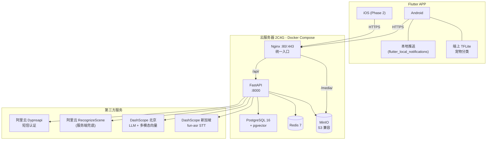

# 当当日记 (DangDang Diary)

> 一款写给猫狗主人的宠物日记 APP — 把"养它的每一天"变成可回看的时间轴。

**当当日记** 是一个 Flutter + FastAPI 全栈项目，把"养它的每一天"沉淀成可回看的时间轴：拍照、写日常、记体重、登记驱虫疫苗，到期本地推送提醒。

核心特色是 **AI 重塑录入体验**——你几乎不用手动整理：

- 🎙️ **长按语音速记**：实时流式 STT + 通义千问意图抽取，一句"奶牛今天 4.2 公斤，吃了驱虫药"自动落成结构化草稿（体重 / 驱虫 / 日常各归各位）。
- 🖼️ **照片自动归档**：DashScope 多模态 Embedding + pgvector 相似度检索，上传照片自动判定属于哪只毛孩子，并通过用户的确认/纠正持续学习。
- 🐾 **入库前 AI 安检**：端侧 TFLite 先判图里有没有猫狗，避免把无关照片传上云。

围绕 AI 之外，还配套：多人**档案共享**（OWNER / EDITOR / VIEWER 角色 + 邀请码）、**到期本地推送**、品牌化 Logo & Splash，以及一套以稳定可用为目标的 MVP 基线（手机号 SMS + JWT、HEIC 转码、EXIF 时间还原、MinIO + Nginx 统一入口）。

---

## 目录

- [一、产品形态](#一产品形态)
- [二、技术栈详解](#二技术栈详解)
- [三、项目亮点](#三项目亮点)
- [四、整体架构](#四整体架构)
- [五、目录结构](#五目录结构)
- [六、快速开始](#六快速开始)
- [七、关键 API 约定](#七关键-api-约定)
- [八、文档索引](#八文档索引)

---

## 一、产品形态

| 模块 | 能力 |
|------|------|
| 认证 | 手机号 + 短信验证码登录，首次登录自动注册；JWT 双 Token，支持多设备登出 |
| 宠物档案 | 多档案 CRUD，头像上传，生日/品种/驱虫周期管理 |
| 照片记录 | 单次最多 5 张，单张 ≤ 15 MB；前端 EXIF 提取拍摄日期，HEIC/HEIF 自动转 JPEG |
| 健康管理 | 体重曲线、内/外驱虫、疫苗、日常护理记录；驱虫倒计时与到期提醒 |
| 时间轴 | 沉浸式照片墙 + 多档案筛选 + 滚动条快速定位 |
| 本地推送 | 驱虫到期前 3 天本地通知，零依赖外部推送服务 |
| 语音速记 *(Phase 2)* | 长按 30 秒说话 → 自动转文字 → LLM 抽槽 → 生成记录草稿 |
| 照片自动归类 *(Phase 2)* | 多模态向量化 + pgvector 相似度，把刚上传的照片自动指认到对应宠物 |
| 档案共享 *(Phase 2)* | OWNER / EDITOR / VIEWER 三级角色，邀请码加入，可主动退出/被移除 |
| 品牌化 *(Phase 2)* | Logo / Splash / AppBar / 加载动效统一品牌资产 |

---

## 二、技术栈详解

### 2.1 前端：Flutter 3.x

| 类别 | 选型 | 用途与说明 |
|------|------|------------|
| 框架 | **Flutter 3.11+** / Dart | 单代码库覆盖 Android / iOS，AI 生成代码质量高 |
| 状态管理 | **flutter_riverpod ^2.5** | 类型安全、可测、解耦 UI 与业务，配合 `AsyncValue` 处理异步状态 |
| 路由 | **go_router ^14** | 声明式路由 + 深链跳转，支持登录拦截 |
| 网络 | **dio ^5.7** | 拦截器统一注入 JWT、自动续 token；APP 唤醒时主动清空连接池避开 NAT 失效 |
| 本地存储 | **shared_preferences** | Token / 偏好持久化 |
| 图像处理 | **image_picker / image_picker_android (Android 13+ Photo Picker)** + **flutter_image_compress** + **exif** | 多选限制真实生效；HEIC → JPEG 在端上完成；EXIF 拍摄日期解析 |
| 端上模型 | **tflite_flutter ^0.11** + **image ^4.3** | 离线宠物（猫/狗）二分类，过滤无关图片，省一次云端调用 |
| 图片缓存 | **cached_network_image** + 自定义 `PaintingBinding` 缓存（512 MiB / 600 entries）| 时间轴缩略图与原图同时常驻，滚动不掉帧 |
| 大图查看 | **photo_view** | 双指缩放、原图懒加载 |
| 本地推送 | **flutter_local_notifications ^18** + **timezone** | 驱虫到期日历调度，无需 FCM/极光 |
| 录音 | **record ^5.1** | 长按语音输入；通过 `dependency_overrides` 修复上游 record_linux 类型不兼容 |
| 矢量品牌 | **flutter_svg** | Logo / Splash / AppBar 复用同一份 SVG |
| 其它 | go_router, intl, pull_to_refresh, permission_handler, path_provider, flutter_slidable, uuid | — |

### 2.2 后端：Python 3.11 + FastAPI

| 类别 | 选型 | 用途与说明 |
|------|------|------------|
| Web 框架 | **FastAPI 0.115** + **Uvicorn[standard]** | 自动生成 Swagger，原生 async；统一异常处理转 `code/message/details` |
| ORM | **SQLAlchemy 2.0 async** + **asyncpg** | 全异步 DB 访问；`AsyncSession` 注入 |
| 迁移 | **Alembic 1.13** | 版本化迁移，支持 pgvector 扩展 |
| 数据校验 | **Pydantic 2.9** + **pydantic-settings** | 强类型请求/响应模型；`.env` 自动加载 |
| 鉴权 | **python-jose[cryptography]** + **passlib[bcrypt]** | JWT 编解码；bcrypt 是为头像 / 备用密钥保留 |
| 缓存 | **redis-py 5.1** | 短信验证码 (5 min TTL)、60 s 重发冷却、分类结果短期缓存 |
| 对象存储 | **minio 7.2** | S3 协议；启动时预创建所有 bucket，省请求路径开销 |
| 文件上传 | **python-multipart** | multipart/form-data 解析 |
| 出站 HTTP | **httpx 0.27** | 调阿里云、DashScope；连接复用 |
| 任务调度 | **apscheduler 3.10** | 后端定时任务（清理临时文件等） |
| 图像 | **Pillow 10.4** | 缩略图生成、EXIF 解析、宠物校验前预处理 |
| 阿里云 | **alibabacloud-dypnsapi**（短信认证）+ **alibabacloud-imagerecog**（场景识别） | SMS + 服务端宠物校验 |
| AI 服务 | **dashscope ^1.20** + **openai ^1.40** | 通义千问 LLM (qwen-flash)、fun-asr 流式 STT、多模态向量化 |
| 向量库 | **pgvector ^0.3** | PostgreSQL 原生向量索引，照片自动归类的相似度引擎 |
| 测试 | **pytest** + **pytest-asyncio** + **aiosqlite** | 单测跑在内存 SQLite 上，无需起 PG |

### 2.3 基础设施（Docker Compose）

| 组件 | 镜像 | 角色 |
|------|------|------|
| **Nginx** | `nginx:1.27-alpine` | 真机唯一入口；`/api/...` → FastAPI、`/media/...` → MinIO |
| **PostgreSQL** | `pgvector/pgvector:pg16` | 关系数据 + 向量索引（pgvector 扩展） |
| **Redis** | `redis:7-alpine` | 验证码、并发限流、分类缓存；启用 AOF |
| **MinIO** | `minio/minio:latest` | S3 兼容对象存储；后期可无痛迁移阿里云 OSS |
| FastAPI | 自建 `python:3.11-slim` 镜像 | 业务后端 |

### 2.4 第三方云服务

- **阿里云号码认证服务（Dypnsapi `SendSmsVerifyCode`）** — 系统赠送签名 + 模板，验证码由 API 自动生成。
- **阿里云视觉智能开放平台 `RecognizeScene`** — 服务端宠物图片二次校验（默认关闭，端上 TFLite 优先）。
- **阿里云 DashScope** — 多区域调度：
  - **新加坡区域** 跑 STT (`fun-asr-realtime`) 与 LLM (`qwen-flash`)，TLS 握手延迟从北京区 6.3 s 降到 2.6 s（实测 N=10）。
  - **北京区域** 跑多模态向量化 (`tongyi-embedding-vision-plus`, 1152 维) 与 STT 兜底。

---

## 三、项目亮点

下面这些是把当当日记从「demo」推到「真能上手用」的关键设计，每一条都对应着代码里能看到的实现，而不是泛泛而谈。

### 3.1 真机统一入口 — 内部地址永不外泄

客户端 **只** 跟 Nginx (:80/:443) 通信，FastAPI 的 `:8000`、MinIO 的 `:9000` 全部隐藏在 Docker 网络里。`/api/...` 反代给 FastAPI，`/media/...` 反代给 MinIO，签名 URL 也基于 `PUBLIC_BASE_URL` 拼装，保证前端拿到的 URL 全部走入口域名 — 既方便上线时换 HTTPS / 更换 OSS，也避免内网地址泄露。

### 3.2 双层宠物图片校验 — 省钱又快

照片上传链路上做了两层防误传：

1. **端上 TFLite**：`tflite_flutter` 加载离线猫狗分类模型，在用户点"上传"前先在手机上判别。无网也能拒绝错图，不消耗云额度。
2. **服务端兜底**：通过 `ENABLE_SERVER_PET_RECOGNITION` 开关接入阿里云 `RecognizeScene`。默认关闭，作为端上模型被绕过时的最后一道关卡。

效果：99% 的"非宠物图"在手机本地就被挡掉，云调用量降一个量级。

### 3.3 端上 EXIF + HEIC 转码 — 拍摄日期 100% 可信

iPhone 默认存 HEIC，且很多 Android 厂商修改过 EXIF。我们在 Flutter 端：

- 用 `exif` 包读取 `DateTimeOriginal`，多张图取第一个有效值，没有则回落到当天；
- 检测到 HEIC/HEIF 直接 `flutter_image_compress` 转 JPEG 再上传。

后端只负责存储，永远不需要为了"拿到拍摄日期"而二次解码原图。

### 3.4 JWT 双 Token + 多设备隔离登出

- **Access Token (2 小时) + Refresh Token (30 天)**，dio 拦截器自动续签；
- `POST /auth/logout` **只作废当前设备**的 refresh token，其他设备不掉线；
- 验证码存 Redis (TTL 5 min, 60 s 重发冷却)，杜绝短信轰炸。

### 3.5 零成本本地推送 — 驱虫不再忘

不接 FCM、不接极光，纯靠 `flutter_local_notifications`：

- APP 启动 / 回前台时，从后端拉一次驱虫与疫苗的最新状态；
- 在端上调度未来若干天的本地通知，到期前 3 天开始提醒，过期后每天补提醒；
- 用户记录新驱虫立刻重排调度。

省下推送通道费用 + 用户隐私不必经过第三方服务。

### 3.6 多档案共享 — owner / editor / viewer 三级角色

- 邀请码 `pet_share_codes` 表 + 一次性使用 + 主动撤销 + 24 h 过期；
- `pet_members` 表存成员关系，FastAPI 在每个写接口上校验 `my_role`；
- 列表接口的 `pet.my_role` 字段让前端能基于角色精准 disable 按钮，避免"点进去才报 403"。

### 3.7 照片自动归类 — pgvector + 多模态向量

最有意思的 Phase 2 功能：上传照片后，后端调用 DashScope 多模态向量化（1152 维）embed 一遍，和该用户每只宠物的 **图心 (centroid)** 做余弦相似度比较，再用 Top-1 阈值 + margin 规则决定归属。

工程上的几个克制设计：

- **去重窗口**：30 天内相似度 ≥ 0.98 的样本不重复入库，避免连拍 10 张同一姿势把图心带偏；
- **来源加权**：用户手动纠正过的样本在打分时获得 `+0.02` 的小幅 boost，只在原本就模棱两可的边界上起作用；
- **阈值可调**：`CLASSIFY_SIM_TOP1_MIN=0.78`、`CLASSIFY_SIM_MARGIN_MIN=0.05` 通过 `.env` 调；
- **缓存**：Redis 短期缓存分类结果，重复点击不重复扣费；
- **并发护栏**：`DASHSCOPE_EMBEDDING_CONCURRENCY=3`，5 张连传不会饿死其他请求路径。

### 3.8 长按语音速记 — STT + LLM 抽槽

Phase 2 Step 2：长按录音 → 上传到后端 → DashScope `fun-asr-realtime` (新加坡区) 流式 STT → 通义千问 `qwen-flash` 抽槽（实体、日期、记录类型）→ 生成结构化草稿，用户在 sheet 里再确认即可保存。

实测延迟（3.1 s 音频）：

| 路径 | p50 | p90 |
|------|-----|-----|
| 北京 paraformer-v1 | 6.34 s | 7.24 s |
| 北京 fun-asr | 6.28 s | 84.2 s（!） |
| **新加坡 fun-asr (现行)** | **2.60 s** | **4.33 s** |

把 STT 路由切到新加坡区是基于真机 benchmark 的硬决策，而不是凭直觉。

### 3.9 性能与可观测性的小心机

代码里多处藏着"在 2C4G VPS 上不要被自己绊倒"的小修正：

- **手动设置 asyncio 线程池大小** (`THREAD_POOL_SIZE=32`)：Python 默认在 2 核机上只有 6，单次 5 张照片 classify + 5 张照片 backfill 立刻饿死；
- **MinIO bucket 启动预创建** (`aensure_all_buckets`)：请求路径上不再做 `head_bucket`；
- **APP 唤醒时清空 dio 连接池**：手机睡了一夜运营商 NAT 4-tuple 早过期，复用旧 socket 会导致返回前台后第一次 POST 神秘卡住；
- **Nginx 自定义 access log**：把 `request_time` / `upstream_response_time` / `request_length` 全打出来，遇到慢请求一眼定位是上传慢、Nginx 慢还是 FastAPI 慢；
- **`assert_production_safe(settings)`**：生产模式下启动前自检密钥、CORS、调试开关，防止把 demo 配置部署上线。

### 3.10 统一的错误与列表协议

- 所有业务错误：`{ "code": "...", "message": "...", "details": {...} }`；
- 列表分页：`page` + `page_size`，新→旧排序；
- 创建/更新返回最新完整对象、删除 `204`、空列表 `200 + []`；
- Pydantic `RequestValidationError` 被 FastAPI 异常处理器**翻译**为业务码（`INVALID_PHONE` / `INVALID_VERIFY_CODE` / `INVALID_NICKNAME`），前端不用再读 Pydantic 的英文报错。

---

## 四、整体架构



---

## 五、目录结构

```
DangDangDiary/
├── backend/                    # Python FastAPI 后端
│   ├── app/
│   │   ├── main.py             # 入口、异常处理器、生命周期钩子
│   │   ├── config.py           # 全部配置 ↔ .env
│   │   ├── database.py         # SQLAlchemy 异步 session
│   │   ├── dependencies.py     # FastAPI 依赖（鉴权、当前用户）
│   │   ├── api/v1/             # 路由层
│   │   │   ├── auth.py         # 短信 + JWT
│   │   │   ├── pets.py         # 宠物档案 CRUD
│   │   │   ├── photos.py       # 上传 / 时间轴
│   │   │   ├── classify.py     # Phase 2: 照片自动归类
│   │   │   ├── health.py       # 体重 / 驱虫 / 疫苗 / 日常
│   │   │   ├── share.py        # Phase 2: 档案共享
│   │   │   ├── voice.py        # Phase 2: 语音速记
│   │   │   └── router.py       # 注册所有子路由
│   │   ├── models/             # SQLAlchemy ORM
│   │   ├── schemas/            # Pydantic 模型
│   │   ├── services/           # 业务逻辑（auth/pet/health/embedding/llm/stt/...）
│   │   ├── tasks/              # 定时任务
│   │   └── utils/              # 工具（security/time/invite_code/production_check）
│   ├── alembic/                # 数据库迁移
│   ├── tests/                  # pytest 单测
│   ├── scripts/                # 运维脚本（stt_bench.py / llm_bench.py 等）
│   ├── requirements.txt
│   ├── Dockerfile
│   └── .env.example
├── frontend/                   # Flutter 客户端
│   └── lib/
│       ├── main.dart           # 入口（cache 调优、Photo Picker 启用）
│       ├── app.dart            # 顶层 App + 生命周期 hook
│       ├── config/             # 路由 / 主题 / base_url
│       ├── models/
│       ├── services/           # api_client / pet_classifier (TFLite) / voice / health_reminder...
│       ├── providers/          # Riverpod
│       ├── screens/
│       │   ├── auth/           # 登录
│       │   ├── record/         # 拍照记录
│       │   ├── health/         # 体重/驱虫/疫苗/日常 4 个 tab
│       │   ├── timeline/       # 时间轴 + 大图
│       │   ├── profile/        # 我的 / 宠物管理 / 档案共享
│       │   └── splash/         # 启动屏
│       ├── widgets/            # 复用组件（语音按钮 / 沉浸式照片格 / 品牌 Logo...）
│       └── utils/
├── nginx/nginx.conf            # 统一入口反代
├── docker-compose.yml          # PG / Redis / MinIO / Nginx 一键起
├── docs/                       # 步骤文档（开发圣经）
└── README.md                   # 本文件
```

---

## 六、快速开始

### 6.1 准备 `.env`

```bash
cp backend/.env.example backend/.env
# 然后填入：
# - 数据库密码、JWT 随机串
# - 阿里云 AccessKey（短信 + 场景识别共用）
# - DashScope 双 Key（北京 + 新加坡）
```

### 6.2 起基础设施

```bash
docker compose up -d        # PG (pgvector) + Redis + MinIO + Nginx
```

### 6.3 后端

```bash
cd backend
python -m venv .venv && source .venv/bin/activate
pip install -r requirements.txt
alembic upgrade head
uvicorn app.main:app --reload --host 0.0.0.0 --port 8000
# Swagger: http://localhost:8000/docs (或 http://<server>/docs 走 Nginx)
```

### 6.4 前端

```bash
cd frontend
flutter pub get
flutter run                    # 真机调试
flutter build apk --release    # 出包
```

### 6.5 测试

```bash
cd backend && pytest -v        # 跑在内存 SQLite，无需 PG
```

---

## 七、关键 API 约定

- 字段全部 `snake_case`
- 列表分页：`page` + `page_size`，新→旧排序，业务语义 key (`pets`/`photos`/`weights`)
- 时间戳 UTC；生日、拍摄日、记录日用 `date`
- 错误响应：`{ "code", "message", "details" }`；输入非法 `400`、无权限 `403`
- 创建/更新返回最新完整对象；删除 `204 No Content`；空列表 `200 + []`
- 客户端只能访问 Nginx 入口；`/api/...` 与 `/media/...` 之外的内部地址永远不出现在响应里

完整 API 列表见 [`docs/DangDangDiary-technical-plan.plan.md`](docs/DangDangDiary-technical-plan.plan.md) §五。

---

## 八、文档索引

| 文档 | 作用 |
|------|------|
| [`docs/00-global-rules.md`](docs/00-global-rules.md) | 跨步骤约定（最高优先级） |
| [`docs/DangDangDiary-technical-plan.plan.md`](docs/DangDangDiary-technical-plan.plan.md) | 总架构、DB、API 全览 |
| [`docs/step1-environment-setup.md`](docs/step1-environment-setup.md) | 环境与项目骨架 |
| [`docs/step2-auth-module.md`](docs/step2-auth-module.md) | 短信 + JWT |
| [`docs/step3-pet-profile.md`](docs/step3-pet-profile.md) | 宠物档案 CRUD |
| [`docs/step4-photo-record.md`](docs/step4-photo-record.md) | 照片上传 + EXIF + 校验 |
| [`docs/step5-health-management.md`](docs/step5-health-management.md) | 体重 / 驱虫 / 疫苗 |
| [`docs/step6-timeline.md`](docs/step6-timeline.md) | 时间轴 |
| [`docs/step7-push-notification.md`](docs/step7-push-notification.md) | 本地推送 |
| [`docs/step8-integration-polish.md`](docs/step8-integration-polish.md) | 鲁棒性 + 自动化测试 |
| [`docs/phase2-step1-pet-share.md`](docs/phase2-step1-pet-share.md) | 档案共享 |
| [`docs/phase2-step2-voice-intake.md`](docs/phase2-step2-voice-intake.md) | 语音速记 |
| [`docs/phase2-step3-photo-auto-assign.md`](docs/phase2-step3-photo-auto-assign.md) | 照片自动归类 |
| [`docs/phase2-step4-logo-splash.md`](docs/phase2-step4-logo-splash.md) | 品牌资产 + Splash |
| [`docs/future-async-task-queue.md`](docs/future-async-task-queue.md) | 未来：异步任务队列 |
| [`docs/future-voice-frontend-streaming.md`](docs/future-voice-frontend-streaming.md) | 未来：前端 PCM 流式上传 |
| [`docs/API_docs/`](docs/API_docs/) | 阿里云 / DashScope 第三方接口参考 |

---

## 九、License

本项目当前为内部开发阶段，暂未公开许可证。如需复用代码或素材请先联系作者。
