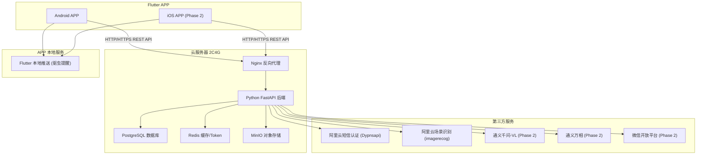
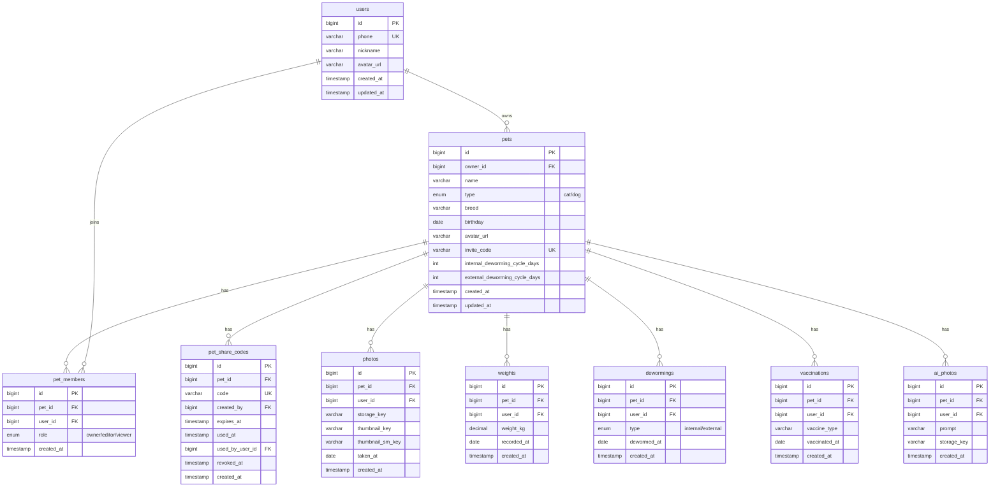

# 当当日记 - 技术方案与开发计划

## 一、整体架构



## 二、技术选型详解

| 层级 | 技术 | 理由 |
|------|------|------|

- **前端**: Flutter 3.x + Dart - 跨平台、Dart 语法接近 C、AI 生成代码质量好
- **后端**: Python 3.11 + FastAPI - 简洁高效、自动生成 API 文档、AI 辅助开发友好
- **数据库**: PostgreSQL 16 - 稳定可靠、功能丰富、免费
- **缓存**: Redis - 存储验证码、JWT Token 黑名单、会话缓存
- **对象存储**: MinIO (开发阶段自建) -> 后期迁移阿里云 OSS - S3 兼容协议，迁移无痛
- **反向代理**: Nginx - 处理 HTTPS、静态资源、负载均衡
- **推送**: Flutter 本地推送 (flutter_local_notifications) - APP 开启/后台时本地触发，无需外部推送服务，零成本
- **短信**: 阿里云号码认证服务 (Dypnsapi SendSmsVerifyCode) - 短信认证一体化，系统赠送签名+模板
- **图片识别**: 阿里云视觉智能开放平台 - 场景识别 (RecognizeScene) - 判断上传图片是否包含宠物
- **容器化**: Docker + Docker Compose - 一键部署所有服务

## 三、数据库设计



## 四、项目目录结构

```
DangDangDiary/
├── backend/
│   ├── app/
│   │   ├── main.py                # FastAPI 入口
│   │   ├── config.py              # 配置管理
│   │   ├── database.py            # 数据库连接
│   │   ├── models/                # SQLAlchemy ORM 模型
│   │   │   ├── user.py
│   │   │   ├── pet.py
│   │   │   ├── photo.py
│   │   │   ├── weight.py
│   │   │   ├── deworming.py
│   │   │   └── vaccination.py
│   │   ├── schemas/               # Pydantic 请求/响应模型
│   │   ├── api/                   # API 路由
│   │   │   ├── auth.py
│   │   │   ├── pets.py
│   │   │   ├── photos.py
│   │   │   ├── health.py
│   │   │   └── ai.py (Phase 2)
│   │   ├── services/              # 业务逻辑
│   │   ├── utils/                 # 工具函数
│   │   └── tasks/                 # 定时任务(推送提醒)
│   ├── alembic/                   # 数据库迁移
│   ├── requirements.txt
│   ├── Dockerfile
│   └── .env.example
├── frontend/
│   ├── lib/
│   │   ├── main.dart
│   │   ├── config/                # 配置、常量、主题
│   │   ├── models/                # 数据模型
│   │   ├── services/              # API 调用服务
│   │   ├── providers/             # 状态管理 (Riverpod)
│   │   ├── screens/               # 页面
│   │   │   ├── auth/              # 登录页
│   │   │   ├── record/            # 记录页
│   │   │   ├── health/            # 健康页
│   │   │   ├── timeline/          # 时间轴页
│   │   │   ├── ai/                # AI 页 (Phase 2)
│   │   │   └── profile/           # 我的页
│   │   ├── widgets/               # 可复用组件
│   │   └── utils/                 # 工具函数
│   ├── pubspec.yaml
│   └── assets/                    # 图标、字体等
├── docker-compose.yml             # 一键启动所有服务
├── nginx/
│   └── nginx.conf
└── README.md
```

## 五、API 设计概览 (RESTful)

### 认证模块
- `POST /api/v1/auth/send-code` - 发送短信验证码
- `POST /api/v1/auth/login` - 手机号+验证码登录(自动注册)
- `POST /api/v1/auth/refresh` - 刷新 Token
- `POST /api/v1/auth/logout` - 当前设备退出登录并作废当前 refresh token

### 宠物档案模块
- `POST /api/v1/pets` - 创建宠物档案
- `GET /api/v1/pets` - 获取我的所有宠物档案
- `PUT /api/v1/pets/{id}` - 更新宠物档案
- `DELETE /api/v1/pets/{id}` - 删除宠物档案
- `POST /api/v1/pets/{id}/share-code` - 生成分享码 (Phase 2)
- `GET /api/v1/pets/{id}/share-code` - 获取当前有效分享码 (Phase 2)
- `DELETE /api/v1/pets/{id}/share-code` - 撤销当前分享码 (Phase 2)
- `POST /api/v1/pets/redeem` - 通过分享码加入档案 (Phase 2)
- `GET /api/v1/pets/{id}/members` - 获取共享成员列表 (Phase 2)
- `PATCH /api/v1/pets/{id}/members/{user_id}` - 修改成员权限 (Phase 2)
- `DELETE /api/v1/pets/{id}/members/{user_id}` - 移除成员 (Phase 2)
- `POST /api/v1/pets/{id}/leave` - 主动退出共享档案 (Phase 2)

### 照片模块
- `POST /api/v1/pets/{id}/photos` - 上传照片(最多9张, 单张<=15MB)
- `GET /api/v1/photos/timeline` - 获取时间轴照片(支持分页、多档案筛选)

### 健康模块
- `POST /api/v1/pets/{id}/weights` - 记录体重
- `GET /api/v1/pets/{id}/weights` - 获取体重历史
- `POST /api/v1/pets/{id}/dewormings` - 记录驱虫
- `GET /api/v1/pets/{id}/dewormings` - 获取驱虫历史
- `PUT /api/v1/pets/{id}/deworming-cycle` - 设置驱虫周期
- `POST /api/v1/pets/{id}/vaccinations` - 记录疫苗
- `GET /api/v1/pets/{id}/vaccinations` - 获取疫苗历史

### AI 模块 (Phase 2)
- `POST /api/v1/ai/pain-detection` - 猫忍痛识别
- `POST /api/v1/ai/generate-photo` - AI 生成照片
- `GET /api/v1/pets/{id}/ai-photos` - 获取 AI 相册

## 六、关键技术实现要点

### 1. 认证流程
- 使用阿里云号码认证服务 (Dypnsapi) 的 `SendSmsVerifyCode` API 发送短信验证码
- 阿里云 AccessKey (短信认证 + 场景识别共用): 通过 `.env` 注入，例如 `YOUR_ALIYUN_ACCESS_KEY_ID` / `YOUR_ALIYUN_ACCESS_KEY_SECRET`
- 签名名称: `速通互联验证码` (系统赠送签名)
- 模板 CODE: `100001` (系统赠送模板)
- 验证码由 API 自动生成 (TemplateParam 使用 `##code##` 占位符)
- 验证码存 Redis (5分钟过期，60秒内不可重发)
- JWT Token 双 Token 机制：Access Token (2小时) + Refresh Token (30天)
- 提供 `logout`，仅作废当前设备的 refresh token
- 首次登录自动创建用户账号

### 2. 照片上传流程
- APP 端处理 EXIF 日期；若用户选择 HEIC/HEIF，则先在前端转换为 JPEG 后再上传
- **宠物图片校验**: 后端调用阿里云视觉智能开放平台「场景识别 (RecognizeScene)」API，检测图片中是否包含猫/狗。未识别到宠物则拒绝上传，提示"未识别到宠物，请换一张图片试试吧！"
- 后端存储到 MinIO，负责生成缩略图，数据库存储 storage_key / thumbnail_key
- 使用 EXIF 信息提取拍摄日期 (APP 端通过 `image_picker` + `exif` 包处理)
- 列表接口直接返回缩略图 URL；点击查看时再请求原图 URL

### 3. 驱虫推送提醒 (本地推送)
- 使用 Flutter `flutter_local_notifications` 插件实现本地推送
- APP 启动或进入后台时，计算所有宠物的驱虫到期状态
- 调度本地通知：到期前3天开始提醒，过期后每天提醒
- 不依赖外部推送服务（如极光推送），无需后端定时任务推送
- 用户记录新驱虫后，重新计算并更新本地通知调度

### 4. 图片 EXIF 日期提取
- Flutter 端使用 `exif` 包读取照片的 DateTimeOriginal 字段
- 多张照片时按顺序取第一个有效日期
- 无有效日期时默认为当天

### 5. 扩展性设计要点
- API 使用 `/v1/` 版本前缀，方便后续升级
- 数据库表预留 Phase 2 所需字段 (invite_code, deworming_cycle 等)
- MinIO 使用 S3 协议，后期可无缝迁移到阿里云 OSS
- 用户模型预留微信登录字段 (wechat_openid, wechat_unionid)

## 六点五、全局默认约定

- 真机开发阶段采用统一入口方案，手机客户端只访问一个入口地址，不直接访问 FastAPI 或 MinIO 内部地址
- 统一入口推荐由 Nginx 提供，路径约定为 `/api/...` 与 `/media/...`
- 接口字段统一使用 `snake_case`
- 业务错误统一为 `code` + `message` + `details`
- 列表接口统一使用 `page` + `page_size` 分页，时间类记录默认按最新在前排序
- 时间戳统一按 UTC 存储；生日、拍摄日期、记录日期等继续使用 `date`
- `.env.example` 与技术文档只能保留占位符，不得出现真实或疑似真实 AccessKey / Secret / 固定生产密码

## 七、开发阶段划分

### Phase 1 - MVP (预估 token 消耗: ~50$)

**步骤 1: 环境搭建与基础框架** (~5$)
- Ubuntu 开发环境配置
- Docker Compose 编排 (PostgreSQL + Redis + MinIO)
- FastAPI 项目骨架 + 数据库模型 + 迁移
- Flutter 项目骨架 + 路由 + 主题

**步骤 2: 认证模块** (~5$)
- 短信验证码发送/验证
- JWT 登录/注册/刷新
- Flutter 登录页面

**步骤 3: 宠物档案管理** (~5$)
- 档案 CRUD API
- Flutter 档案管理页面 (我的 -> 宠物档案)
- 档案选择器组件 (顶部三角切换)

**步骤 4: 照片记录** (~8$)
- 照片上传 API (含 MinIO 存储)
- 宠物图片校验 (阿里云场景识别 RecognizeScene API)
- Flutter 记录页面 (选档案、选照片、日期选择)
- EXIF 日期提取

**步骤 5: 健康管理** (~10$)
- 体重/驱虫/疫苗 CRUD API
- Flutter 健康页面 (三个子页面 + 时间轴列表 + 记录浮动按钮)
- 驱虫倒计时计算与显示
- 疫苗类型预设选项

**步骤 6: 时间轴** (~8$)
- 时间轴照片分页查询 API
- Flutter 时间轴页面 (瀑布流/网格 + 滚动条定位 + 多档案筛选)

**步骤 7: 推送提醒** (~5$)
- Flutter 本地推送集成 (flutter_local_notifications)
- APP 端驱虫到期计算 + 本地通知调度

**步骤 8: 整合调试 + UI 打磨** (~4$)
- 整体流程测试
- UI 细节打磨 (简约+温馨风格)
- 错误处理与边界情况

### Phase 2 - 扩展功能 (预估 token 消耗: ~30$)
- 微信登录
- 档案共享 (邀请码)
- 猫忍痛识别 (通义千问-VL)
- AI 生成宠物照片 (通义万相)
- iOS 适配
- 会员等级系统

## 八、你需要准备的内容

### 需要注册的账号与 API

**Phase 1 必需:**
1. **阿里云账号** - 已就绪，AccessKey 通过 `.env` 注入，例如 `YOUR_ALIYUN_ACCESS_KEY_ID` / `YOUR_ALIYUN_ACCESS_KEY_SECRET`
   - 已开通号码认证服务 (Dypnsapi)，签名「速通互联验证码」、模板 CODE `100001`。API 详见 `docs/发送短信验证码.md`
   - 已开通视觉智能开放平台 - 场景识别 (RecognizeScene)，用于宠物图片校验。API 详见 `docs/本文档为您介绍场景识别常用语言和常见情况的示例代码.md`
2. **域名** (可选，开发阶段可用 IP 直连) - 如需 HTTPS 则需要域名+SSL 证书
3. ~~极光推送~~ - 已改为 APP 本地推送，无需外部推送服务账号

**Phase 2 需要:**
4. **阿里云 DashScope 账号** - 开通通义千问-VL 和通义万相 API (开通即有免费额度)
5. **微信开放平台账号** - 注册需要企业资质，创建移动应用获取 AppID 和 AppSecret

### 需要准备的素材

1. **APP Logo** - 需要提供以下尺寸: 1024x1024 (应用商店)、192x192、144x144、96x96、72x72、48x48 (Android 各密度)，建议提供 SVG 或 1024x1024 PNG，我可以帮你用代码裁剪
2. **底边栏图标 x5** - 记录、健康、时间轴、AI、我的，每个图标需要「选中」和「未选中」两种状态，建议 SVG 格式或 48x48 PNG
3. **APP 名称确认** - "当当日记" 作为显示名称
4. **短信签名名称** - 使用系统赠送签名「速通互联验证码」(已确定，无需自定义签名)
5. **启动页 Logo** (可选) - 可复用 APP Logo

### 开发环境搭建 (Ubuntu)

开发环境搭建将作为正式开发的第一步，主要安装:

- **Docker + Docker Compose** - 运行 PostgreSQL、Redis、MinIO
- **Flutter SDK 3.x** - 前端开发
- **Android SDK + Android Studio** (或仅命令行工具) - Android 编译
- **Python 3.11+** - 后端开发
- **Git** - 版本控制
- **VS Code 或 Cursor** - 代码编辑器 (你已在使用 Cursor)

具体安装命令将在确认方案后的第一步执行。

## 九、开发流程建议

由于采用 vibe coding 方式，建议遵循以下流程:
1. 每个功能模块先完成后端 API，用 FastAPI 自动生成的 Swagger 文档测试
2. 再开发对应的 Flutter 前端页面
3. 前后端联调
4. 每完成一个模块 git commit，保持可回退
5. 使用 Docker Compose 确保环境一致性

## 十、2C4G 服务器资源评估

当前配置 (2C4G 50G) 在开发验证阶段完全够用:
- PostgreSQL: ~256MB RAM
- Redis: ~64MB RAM
- MinIO: ~256MB RAM
- FastAPI: ~256MB RAM
- Nginx: ~32MB RAM
- 系统+Docker: ~512MB RAM
- 剩余: ~2.5GB 可用

存储方面，50G 除去系统和服务约剩 35G 可用于照片存储。按单张照片平均 5MB 计算，约可存 7000 张照片，开发验证足够。
