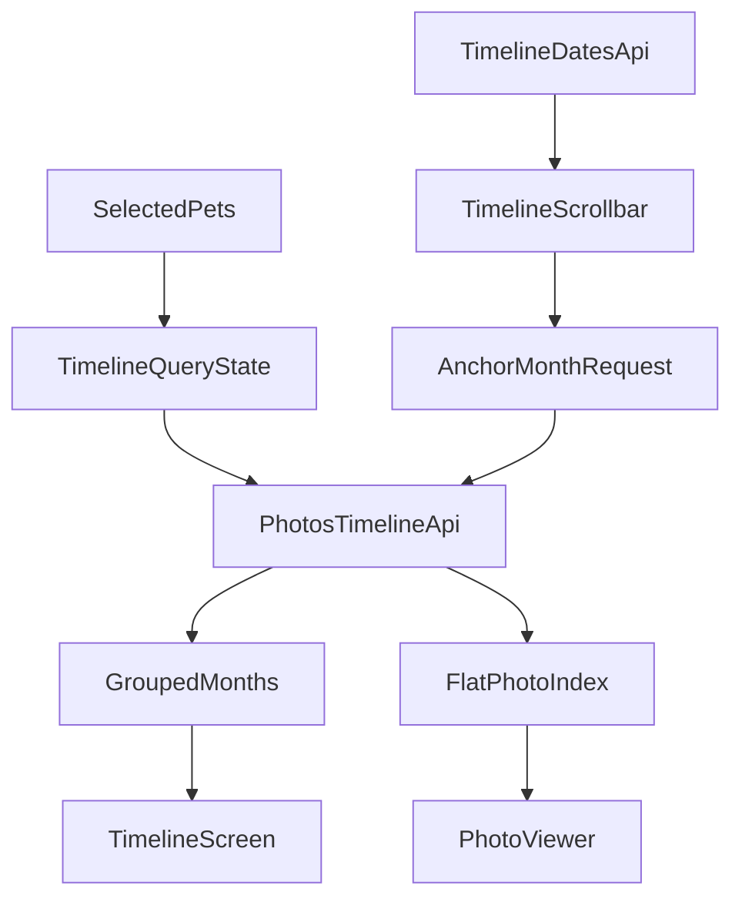

# Step 6: 照片时间轴

## 项目背景

「当当日记」是一个宠物日记 APP，使用 Flutter + FastAPI + PostgreSQL + MinIO 技术栈。本步骤实现照片时间轴功能，用户可以跨宠物按时间顺序浏览照片，并通过右侧月份滚动条快速跳转到任意月份。

**前置依赖**:
- Step 4 已完成: 照片上传、缩略图、原图 URL 接口可用
- Step 5 已验证无问题: 主导航中的「时间轴」Tab 已预留，健康模块不参与本步数据源

---

## 本步骤目标

1. 后端实现照片时间轴 API，支持多宠物筛选、游标分页、按月锚点跳转
2. 后端实现月份分布 API，供右侧时间轴滚动条展示和定位
3. Flutter 实现时间轴页面: 网格布局、按月分组、无限滚动、拖拽跳月
4. Flutter 实现大图查看器: 双指缩放、左右连续浏览、懒加载原图
5. 保证时间轴和查看器共用同一套筛选条件与游标语义，避免数据断层

---

## 1. 范围与关键决策

### 1.1 本步范围

- 时间轴只展示照片，不混入体重、驱虫、疫苗等健康记录
- 照片来源于当前用户通过 `pet_members` 可访问的所有宠物档案
- 顶部宠物筛选器为多选模式，空选择视为“全部可访问宠物”
- 时间轴主列表按月分组展示，但内部数据流必须保留一份全局有序的扁平照片索引，供大图查看器连续浏览

### 1.2 非目标

- 本步不实现“混合事件时间轴”
- 本步不改动 Step 4 的照片上传流程
- 本步不把健康记录回灌到时间轴中

### 1.3 统一排序规则

所有时间轴查询、月份锚点定位、查看器连续浏览都必须使用同一套稳定排序:

`taken_at desc, created_at desc, id desc`

说明:
- `taken_at` 是主时间字段，代表照片拍摄日期
- `created_at` 用于同一天多张照片时保持稳定顺序
- `id` 用于最终打破并列，保证游标可重复、可去重

游标必须基于这三个字段生成，推荐使用不透明字符串，不要把客户端绑定到具体编码格式。

---

## 2. 后端 API 规格

所有 API 需要 `Authorization: Bearer {access_token}` 头。

权限说明:
- 当前用户只能查询自己可访问宠物档案下的照片
- `pet_ids` 为空或缺省时，表示查询当前用户全部可访问宠物
- 若请求中的某个 `pet_id` 不在当前用户可访问范围内，应返回 `403`

### 2.1 获取时间轴照片

统一使用单接口 `GET /api/v1/photos/timeline`，通过 `cursor` 和 `anchor_month` 支持三类场景:

1. 首屏加载最新照片
2. 向更旧或更新方向继续补片
3. 拖动右侧时间轴后按月份锚点定位并插入一段新窗口

#### 请求示例

首屏加载:

```
GET /api/v1/photos/timeline?pet_ids=1,2&limit=40
Authorization: Bearer {access_token}
```

继续向更旧方向加载:

```
GET /api/v1/photos/timeline?pet_ids=1,2&cursor=eyJ0YWtlbl9hdCI6ICIyMDI0LTAxLTE1IiwgLi4ufQ==&direction=older&limit=40
Authorization: Bearer {access_token}
```

从已加载窗口向更新方向补片:

```
GET /api/v1/photos/timeline?pet_ids=1,2&cursor=eyJ0YWtlbl9hdCI6ICIyMDI0LTAxLTE1IiwgLi4ufQ==&direction=newer&limit=40
Authorization: Bearer {access_token}
```

按月份锚点定位:

```
GET /api/v1/photos/timeline?pet_ids=1,2&anchor_month=2024-01&limit=40
Authorization: Bearer {access_token}
```

#### 查询参数

- `pet_ids`: 宠物 ID 列表，逗号分隔，可选；为空或缺省表示全部可访问宠物
- `limit`: 单次返回的照片数量上限，默认 `40`，最大 `100`
- `cursor`: 不透明游标，可选；用于继续向 `older` 或 `newer` 方向加载
- `direction`: `older` 或 `newer`，默认 `older`；仅在传入 `cursor` 时有效
- `anchor_month`: 月份锚点，格式 `YYYY-MM`，可选；用于右侧时间轴拖拽定位

#### 参数约束

- `cursor` 和 `anchor_month` 互斥，不能同时传
- `direction` 只能与 `cursor` 一起使用
- `anchor_month` 格式错误、`cursor` 无法解析、`limit` 超出上限，都应返回 `400`
- 当筛选结果为空时，返回 `200` 和空数组，不返回 `404`

#### 成功响应 (200)

```json
{
  "groups": [
    {
      "date": "2024-01",
      "label": "2024年1月",
      "photos": [
        {
          "id": 101,
          "pet_id": 1,
          "pet_name": "橘子",
          "pet_type": "cat",
          "thumbnail_url": "/media/pet-photos/1/thumb-101.jpg",
          "taken_at": "2024-01-15",
          "created_at": "2024-01-20T10:30:00Z"
        },
        {
          "id": 99,
          "pet_id": 2,
          "pet_name": "年糕",
          "pet_type": "dog",
          "thumbnail_url": "/media/pet-photos/2/thumb-99.jpg",
          "taken_at": "2024-01-08",
          "created_at": "2024-01-09T08:15:00Z"
        }
      ]
    },
    {
      "date": "2023-12",
      "label": "2023年12月",
      "photos": [
        {
          "id": 88,
          "pet_id": 1,
          "pet_name": "橘子",
          "pet_type": "cat",
          "thumbnail_url": "/media/pet-photos/1/thumb-88.jpg",
          "taken_at": "2023-12-30",
          "created_at": "2024-01-01T11:00:00Z"
        }
      ]
    }
  ],
  "total": 150,
  "limit": 40,
  "prev_cursor": null,
  "next_cursor": "eyJ0YWtlbl9hdCI6ICIyMDIzLTEyLTMwIiwgLi4ufQ==",
  "has_more_newer": false,
  "has_more_older": true,
  "requested_anchor_month": null,
  "resolved_anchor_month": null,
  "date_range": {
    "earliest": "2023-01-15",
    "latest": "2024-01-20"
  }
}
```

#### 字段说明

- `groups`: 当前返回窗口按月分组后的结果；组内和组间顺序都必须符合统一排序规则
- `total`: 当前筛选条件下的照片总数，不受本次窗口大小影响
- `limit`: 本次查询使用的窗口大小
- `prev_cursor`: 指向当前窗口最前端，用于继续向 `newer` 方向补片；如果没有更“新”的内容则为 `null`
- `next_cursor`: 指向当前窗口最末端，用于继续向 `older` 方向补片；如果没有更“旧”的内容则为 `null`
- `has_more_newer`: 当前筛选条件下是否还存在比本窗口更“新”的照片
- `has_more_older`: 当前筛选条件下是否还存在比本窗口更“旧”的照片
- `requested_anchor_month`: 本次请求传入的锚点月份，首屏加载和普通滚动加载时为 `null`
- `resolved_anchor_month`: 后端实际命中的月份；如果请求月份在当前筛选条件下没有照片，可回退到最近的有照片月份
- `date_range`: 当前筛选条件下的全局最早和最新照片日期，供前端显示月份边界和空状态判断

#### 业务逻辑

- 查询源为 `photos` 表，按当前用户可访问的 `pet_id` 集合过滤
- 必须联表或补查宠物信息，返回 `pet_name` 和 `pet_type`
- 缩略图 URL 返回固定 `/media/...` 路径，不返回内网地址，不使用一次性签名 URL
- 首屏加载默认返回最新一段照片
- `direction=older` 时，返回排序上位于游标之后的更旧照片
- `direction=newer` 时，返回排序上位于游标之前的更新照片
- `anchor_month` 请求时，后端返回“覆盖目标月份的一段窗口”，前端据此把该窗口插入现有结果中，而不是清空整个时间轴

#### 月份锚点规则

- `anchor_month` 只接受 `YYYY-MM`
- 若目标月份已有照片，返回的窗口必须包含该月份照片，并优先让该月份出现在返回结果的前半段，便于前端滚动定位
- 若目标月份没有照片:
  - 优先回退到最近的更旧月份
  - 若不存在更旧月份，再回退到最近的更新月份
  - 若筛选条件下没有任何照片，返回空结果
- 前端右侧月份滚动条应优先使用 `GET /api/v1/photos/timeline/dates` 返回的月份列表，正常情况下不会拖到没有照片的月份；上述回退逻辑主要用于兜底和并发场景

#### 分组约束

- 一个返回窗口内仍按月份分组返回
- 同一个月份可能在多次请求中重复出现，前端必须按 `date` 合并，而不是简单拼接 `groups`
- 去重必须以 `photo.id` 为准，不能依赖月份或索引位置

### 2.2 获取时间轴日期分布

```
GET /api/v1/photos/timeline/dates?pet_ids=1,2
Authorization: Bearer {access_token}
```

#### 查询参数

- `pet_ids`: 宠物 ID 列表，逗号分隔，可选；为空或缺省表示全部可访问宠物

#### 成功响应 (200)

```json
{
  "months": [
    {
      "date": "2024-01",
      "label": "2024年1月",
      "count": 15
    },
    {
      "date": "2023-12",
      "label": "2023年12月",
      "count": 8
    },
    {
      "date": "2023-11",
      "label": "2023年11月",
      "count": 23
    }
  ],
  "date_range": {
    "earliest": "2023-01-15",
    "latest": "2024-01-20"
  }
}
```

#### 用途

- 右侧时间轴滚动条展示月份标记和相对密度
- 拖动时显示年月气泡提示
- 过滤条件变化后重新请求，用于刷新滚动条的月份范围和密度

### 2.3 获取照片原图

```
GET /api/v1/photos/{photo_id}/url
Authorization: Bearer {access_token}
```

成功响应 (200):

```json
{
  "url": "http://YOUR_SERVER_IP/media/pet-photos/1/xxx.jpg?X-Amz-...",
  "expires_in": 3600
}
```

说明:
- 该接口已在 Step 4 中实现，本步直接复用
- 大图查看器只在用户真正打开大图时才请求原图 URL
- 原图 URL 仍为临时签名地址，不缓存到长期状态中

---

## 3. Flutter 页面与数据流设计

### 3.1 页面整体布局

```
┌─────────────────────────────────┐
│  全部宠物 ▼  (多选宠物筛选器)     │
├─────────────────────────────────┤
│  ── 2024年1月 ──               │
│  ┌────┐ ┌────┐ ┌────┐ ┌────┐   │
│  │缩略图│ │缩略图│ │缩略图│ │缩略图│   │
│  └────┘ └────┘ └────┘ └────┘   │
│  ┌────┐ ┌────┐ ┌────┐          │
│  │缩略图│ │缩略图│ │缩略图│          │
│  └────┘ └────┘ └────┘          │
│                                 │
│  ── 2023年12月 ──               │
│  ...                            │
│                                 │
│  (继续向下滚动加载更旧照片...)      │
│                                 │
│                           ┌──┐  │
│                           │年│  │
│                           │月│  │
│                           │轴│  │
│                           └──┘  │
├─────────────────────────────────┤
│  记录  │  健康  │ 时间轴 │  AI  │ 我的 │
└─────────────────────────────────┘
```

### 3.2 核心交互

1. 顶部宠物筛选器
   - 使用现有 `PetSelector` 多选模式
   - 默认显示“全部宠物”
   - 当用户把已选宠物全部取消时，等价于“全部可访问宠物”
   - 筛选条件变化时，时间轴主数据和月份分布一起重载

2. 照片网格
   - 按月分组，每月一个标题
   - 每行 4 张缩略图，正方形裁切
   - 多宠物混合展示时，缩略图左下角显示宠物名字标签
   - 使用 `cached_network_image` 缓存缩略图
   - 滚动到底部时，按 `next_cursor` 继续加载更旧照片

3. 大图查看器
   - 点击缩略图进入全屏查看器
   - 使用 `photo_view` 支持双指缩放
   - 使用 `PageView` 支持左右连续浏览
   - 查看器使用时间轴同一份筛选条件和扁平照片索引，不以“当前月份”作为边界
   - 当滑到已加载数据边界附近时，自动用同一套游标继续补片

4. 右侧时间轴滚动条
   - 使用 `timeline/dates` 的月份分布绘制月份标记
   - 拖动时显示年月气泡
   - 如果目标月份已在本地加载，直接滚动到对应月份标题
   - 如果目标月份尚未加载，则发起 `anchor_month` 请求，把新窗口插入本地数据后再滚动到命中的月份

### 3.3 空状态

```
┌─────────────────────────────────┐
│                                 │
│                                 │
│          还没有照片哦             │
│      去「记录」页面上传第一张吧     │
│                                 │
│                                 │
└─────────────────────────────────┘
```

空状态触发条件:
- 当前筛选条件下没有任何照片
- `timeline/dates` 返回空 `months`
- 主列表首次加载成功，但 `groups` 为空

### 3.4 AppBar 布局与浏览模式切换

时间轴页面 `AppBar` 使用与健康页一致的左对齐布局:

```
┌───────────────────────────────────────────────┐
│ 全部宠物 ▼                       [日历] [沉浸] │
├───────────────────────────────────────────────┤
│  ── 2024年1月 ──                              │
│  ┌────┐ ┌────┐ ┌────┐ ┌────┐                  │
│  │缩略图│ │缩略图│ │缩略图│ │缩略图│                  │
│  └────┘ └────┘ └────┘ └────┘                  │
└───────────────────────────────────────────────┘
```

- 左侧: 复用 `PetSelector` 多选模式，固定靠左对齐
- 右侧: 两个模式切换图标按钮
  - 日历模式: 九宫格图标 `Icons.grid_view_rounded`
  - 沉浸模式: 上下两格图标 `Icons.view_agenda_outlined`
- 当前选中的模式图标需要有明确高亮态（如主题色背景/图标染色）
- 两个图标水平相邻，点击即切换，不需要额外确认

浏览模式说明:

| 模式 | 内容区行为 |
|------|--------|
| 日历模式（默认）| 维持原有按月分组 + `SliverGrid`（每行 4 张缩略图）+ 右侧月份滚动条 |
| 沉浸模式 | 不显示月份标题、不显示右侧滚动条，使用单列大图流，每张占一整行，可连续上下滑动 |

沉浸模式细化:
- 列表数据源仍为 `orderedPhotoIds` + `photoMap`，不重新请求接口
- 单列 `ListView.builder`，每项展示一张缩略图（保持原始宽高比，避免裁切）
- 滚动到底部时继续按 `tailCursor` + `direction=older` 补片，逻辑与日历模式一致
- 不显示日期文案，仅显示图片本身；若多宠物混合浏览，仍在左下角叠加宠物名字标签，方便区分
- 点击图片: 进入现有的全屏 `PhotoViewerScreen`，与日历模式一致

模式切换约束:
- 切换不应触发 `refresh`，只切换渲染组件
- 切换后保留当前筛选条件、当前已加载窗口
- 浏览模式状态存放在页面本地（或独立的 UI provider），不进入 `TimelineState`

### 3.5 长按删除照片

删除入口只出现在时间轴主页面，两种浏览模式的交互路径不同，但最终都走 `DELETE /api/v1/photos/{photo_id}`（Step 4 已有接口）。大图查看器内不再承担删除交互。

#### 3.5.1 日历模式 —— 长按进入多选批量删除

> 当前实现以 `PhotoGridTile.selectionMode / selected` + `TimelineScreen._selectionMode / _selectedIds` 为准。

1. 长按任意缩略图 → 进入"选择模式"，该张缩略图立即被选中
2. 选择模式下 `AppBar` 切换为"已选 N/9"的选择态标题 + 左上角关闭按钮；右侧月份滚动条隐藏
3. 选择模式下单击缩略图为"切换选中状态"，不再进入大图查看器
4. 支持累计选择，**单次最多 9 张**；超过上限时轻量提示"一次最多选择 9 张照片"，不静默丢弃
5. 页面底部出现操作条，仅包含"删除 (N)"按钮，N 为当前已选数量；`N = 0` 时按钮禁用
6. 点击"删除 (N)" → 弹出二次确认 `AlertDialog`：
   - 多于 1 张: "确定删除这 N 张照片吗？"
   - 恰好 1 张: "确定删除这张照片吗？"
   - 副文案统一为"删除后不可恢复"
7. 确认后逐个串行调用 `PhotoService.deletePhoto(id)`，结果聚合展示:
   - 全部成功: "已删除 N 张"
   - 全部失败: "删除失败，请稍后重试"
   - 部分成功: "已删除 X 张，Y 张失败"
8. 成功的 id 通过 `timelineProvider.notifier.removePhotos(ids)` 从本地状态中**乐观移除**，不触发整页 `refresh()`
9. 退出选择模式的方式：点击 AppBar 左侧关闭按钮、硬件返回键（通过 `PopScope` 拦截）、或下拉刷新（刷新前会先退出选择模式）
10. 切换到沉浸模式、或下拉刷新、或被移除的照片已不在 `photoMap` 中时，会自动退出选择模式 / 清理失效 id

#### 3.5.2 沉浸模式 —— 长按单张删除

沉浸模式下由于每行只有一张图，不做多选：

1. 长按任一图片 → 底部弹出 `showModalBottomSheet`，含"删除"与"取消"两项
2. 选择"删除" → 弹出 `AlertDialog` 二次确认"确定删除这张照片吗？删除后不可恢复"
3. 确认后调用 `PhotoService.deletePhoto(photoId)`，成功后同样通过 `removePhotos([photoId])` 乐观移除；失败时通过解析 `DioException` 的 `code/message` 字段给出提示

#### 3.5.3 乐观删除的状态更新

删除成功后**不**重拉列表，而是在本地直接更新，避免滚动位置跳动和月份索引抖动：

- `TimelineNotifier.removePhotos(Iterable<int> ids)`：
  - 从 `photoMap` / `orderedPhotoIds` 中剔除指定 id
  - 基于新的 `orderedPhotoIds` 重新 `regroupByMonth` + `rebuildMonthIndex`
  - 按月扣减 `monthDistribution[*].count`，`count` 归零的月份会被过滤掉
  - `total` 同步减去删除成功的数量，并做 `clamp(0, state.total)` 防御
  - 同时调用 `OriginalPhotoCache.instance.removePhoto(id)` 释放本地原图缓存（见 3.6）

#### 3.5.4 实现要点汇总

- `PhotoGridTile` 暴露 `onLongPress`、`selectionMode`、`selected`；选中态以半透明黑色蒙层 + 右上角勾选圆点呈现
- `TimelineScreen` 保存 `_selectionMode`/`_selectedIds`；`_onTapPhoto` 根据 `_selectionMode` 决定是切换选中还是打开查看器
- 请求并发度：日历模式的批量删除当前是**串行**的 `for`，不做并发，以便准确分辨每张的成功/失败
- 选择模式仅作用于日历模式；进入沉浸模式时会在下一帧自动退出选择模式

### 3.6 原图本地持久化缓存 (`OriginalPhotoCache`)

沉浸模式下每张图片独占一行，如果每次都加载缩略图，会出现像素化 + 体验掉档；同时大图查看器也频繁请求签名原图。为此前端新增了一个跨页面共享的**原图持久化缓存**，位于 `frontend/lib/services/original_photo_cache.dart`，作为全局单例：

- 存储位置: `ApplicationSupportDirectory/original_photo_cache/`
- 缓存键: 稳定的 `photo_<photo_id>`（服务端 id），上传前过渡态使用 `pending_<token>`
- 持久化索引: `index.json`，记录每个 entry 的 `key / size / last_access`
- 配额: 默认 **1 GiB (`_defaultMaxBytes`)**，超配额时按 LRU 淘汰到 90% 低水位
- 原子写: 下载/索引持久化都走临时文件 + `rename`，避免半写入
- 启动时会把索引与磁盘现状做 reconcile：补齐 size、删除索引里已不存在的文件、清理无索引的孤儿文件

#### 3.6.1 写入路径

1. **上传前 (Step 4 记录页)**:
   - 记录页在 `_ensureJpeg` 得到压缩后的 JPEG 后，会调用 `OriginalPhotoCache.cacheUploadSource(file)` 把字节拷贝进缓存，得到一个不透明的 `pending` token，并与选中的照片一一对应保存在 `_pendingTokens` 中
   - 上传成功时遍历 `response.successes`，逐个调用 `bindPendingToPhoto(token, photo.id)`，把 `pending_<token>` 文件**原地 rename** 成 `photo_<id>`，LRU 时间刷新
   - 删除一张未上传的选中照片 / 重置页面时会 `releasePending(token)`，把 `pending_` 条目删掉
   - 上传失败时 **不**释放 pending，让用户重试上传时可以复用同一份字节

2. **下载路径 (时间轴/查看器/沉浸模式)**:
   - `fetchOriginal(photoId)`: 命中 `photo_<id>` 直接返回本地 `File`；未命中则向后端请求 `GET /api/v1/photos/{id}/url` 拿到短期签名 URL → `Dio.download` 到 `.tmp_` 临时文件 → 原子 `rename` 为最终文件 → 更新索引 → 触发 `revision++`
   - `prefetch(photoId)`: 后台 fire-and-forget 版本，内部走 `fetchOriginal`；并发重复调用会被 `_inflightDownloads` / `_prefetching` 去重

3. **删除路径**: `TimelineNotifier.removePhotos` 在乐观删除本地状态时会对每个被删除的 id 调 `removePhoto(photoId)`，把缓存文件和索引条目一起清掉。

#### 3.6.2 读取路径

- `OriginalPhotoImage` widget (`frontend/lib/widgets/original_photo_image.dart`)
  - 沉浸模式每一行用这个组件展示，优先 `Image.file(cachedOriginal)`，原图还未就绪时回退到 `CachedNetworkImage(thumbnailUrl)`，三种错误态共用同一 `errorBuilder`
  - 监听 `OriginalPhotoCache.instance.revision`（`ValueNotifier<int>`）：其他照片的缓存变化会让它再调一次 `getCachedOriginalFile(photoId)`，把刚下完的原图无感切换进来

- 大图查看器 (`photo_viewer_screen.dart`)
  - 每页通过 `_futureCache.putIfAbsent(id, () => OriginalPhotoCache.instance.fetchOriginal(id))` 拿 `Future<File>`，再用 `PhotoView(imageProvider: FileImage(file))` 渲染
  - 不再直接调用 `PhotoService.getOriginalUrl`，也不再走 `NetworkImage`

#### 3.6.3 预取策略

- 沉浸模式 `TimelineScreen._prefetchAround`: 以当前可见项为中心，向前 `1`、向后 `2` 预取（`_immersivePrefetchBehind / _immersivePrefetchAhead`）
- 大图查看器 `_prefetchNeighbors`: 当前页左右各 `_viewerPrefetchRadius = 2` 预取，`onPageChanged` 时重算
- 预取全部走 `OriginalPhotoCache.prefetch`，由缓存内部做 in-flight 去重，调用方不必判重

#### 3.6.4 后端/签名 URL 约束不变

缓存层的引入不改变 Step 4 / Step 6 的后端协议：
- 原图仍只通过 `GET /api/v1/photos/{photo_id}/url` 暴露短期签名 URL，`expires_in` 默认 `3600`
- 客户端不长期保存签名 URL 本身，只保存按 `photo_id` 命名的二进制
- 所以签名过期/轮换不会让旧缓存失效；而服务端删除照片后，前端通过 `DELETE` 成功回调里的 `removePhoto(id)` 同步释放本地副本

---

## 4. 前端数据模型与状态设计

### 4.1 基础模型

```dart
class TimelinePhoto {
  final int id;
  final int petId;
  final String petName;
  final String petType;
  final String thumbnailUrl;
  final DateTime takenAt;
  final DateTime createdAt;
}

class TimelineGroup {
  final String date; // "2024-01"
  final String label; // "2024年1月"
  final List<TimelinePhoto> photos;
}

class DateDistribution {
  final String date; // "2024-01"
  final String label;
  final int count;
}

class TimelineWindowResponse {
  final List<TimelineGroup> groups;
  final int total;
  final int limit;
  final String? prevCursor;
  final String? nextCursor;
  final bool hasMoreNewer;
  final bool hasMoreOlder;
  final String? requestedAnchorMonth;
  final String? resolvedAnchorMonth;

  List<TimelinePhoto> get flattenedPhotos =>
      groups.expand((group) => group.photos).toList();
}
```

### 4.2 Provider 内部状态

为了同时满足“按月分组展示”和“查看器连续浏览”，`TimelineProvider` 不应只存一份 `groups`，而应维护以下核心状态:

```dart
class TimelineState {
  final List<TimelineGroup> groups;
  final Map<int, TimelinePhoto> photoMap;
  final List<int> orderedPhotoIds; // 全局顺序: newest -> oldest
  final List<TimelineSegment> segments;
  final Map<String, int> monthFirstPhotoIndex;
  final List<DateDistribution> monthDistribution;
  final String? headCursor;
  final String? tailCursor;
  final bool hasMoreNewer;
  final bool hasMoreOlder;
  final bool isInitialLoading;
  final bool isLoadingMore;
  final Set<String> loadingAnchorMonths;
}

class TimelineSegment {
  final String segmentId;
  final String? prevCursor;
  final String? nextCursor;
  final List<int> photoIds;
}
```

说明:
- `groups` 给时间轴列表 UI 使用
- `orderedPhotoIds` 给大图查看器和边界预加载使用
- `segments` 记录每一段已加载窗口及其局部边界游标，方便拖拽跳月后做局部补片
- `monthFirstPhotoIndex` 用于把月份映射到滚动目标
- `headCursor` / `tailCursor` 表示整份已加载数据的全局两端游标

### 4.3 数据流总览



### 4.4 Provider 关键职责

- 首屏进入时间轴时:
  - 拉取 `timeline/dates`
  - 拉取最新窗口 `GET /photos/timeline`
  - 建立 `photoMap`、`orderedPhotoIds`、`groups`

- 底部无限滚动时:
  - 使用 `tailCursor` + `direction=older` 继续加载
  - 去重后追加到全局扁平索引
  - 重新生成受影响月份的 `groups`

- 拖动右侧月份条时:
  - 如果月份已加载，直接滚动
  - 如果未加载，调用 `anchor_month`
  - 收到响应后插入为新的 `segment`
  - 去重、重排、合并月份后再滚动到 `resolved_anchor_month`

- 大图查看器左右滑动时:
  - 从 `orderedPhotoIds` 获取当前页照片
  - 接近头尾边界时判断是否需要向 `newer` 或 `older` 方向补片
  - 使用对应游标请求后继续合并，不打断当前查看体验

### 4.5 合并策略

```dart
void mergeWindow(TimelineWindowResponse response) {
  for (final photo in response.flattenedPhotos) {
    photoMap[photo.id] = photo;
  }

  orderedPhotoIds = mergeAndSortByStableKey(
    orderedPhotoIds,
    response.flattenedPhotos.map((e) => e.id).toList(),
    photoMap,
  );

  segments = mergeSegments(segments, response);
  groups = regroupByMonth(orderedPhotoIds, photoMap);
  monthFirstPhotoIndex = rebuildMonthIndex(groups);
}
```

合并规则:
- 以 `photo.id` 去重
- 以统一排序规则重建全局顺序
- 如果新窗口与已有窗口发生重叠，合并 `segment`
- 同一个月跨多次请求出现时，只保留一个月份标题

---

## 5. Flutter 实现要点

### 5.1 时间轴主页面

- `timeline_screen.dart` 从占位页升级为真实页面
- 页面顶层建议使用 `Stack`
  - 底层为 `CustomScrollView`
  - 上层右侧叠加 `TimelineScrollbar`
- 使用 `SliverToBoxAdapter + SliverGrid` 渲染月份标题和照片网格
- 由于缩略图均为正方形，可固定网格比例，减少滚动过程中布局抖动

### 5.2 右侧时间轴滚动条

滚动条实现建议:

- 输入:
  - `monthDistribution`
  - 当前屏幕滚动位置
  - 当前已加载月份索引
- 输出:
  - 拖动过程中的气泡文案
  - 目标月份 `YYYY-MM`
  - 对应的跳转动作

处理流程:

1. 拖动时根据手指位置映射到最近的月份标记
2. 显示 `label` 气泡，例如“2024年1月”
3. 拖动结束后:
   - 若该月份已加载，直接滚动到月份标题
   - 若未加载，调用 `jumpToMonth(month)`
4. `jumpToMonth` 请求成功后滚动到 `resolved_anchor_month`

### 5.3 大图查看器

查看器必须是“当前筛选条件下的连续照片浏览”，不是“当前月份内浏览”。

建议实现:

```dart
class PhotoViewerScreen extends ConsumerStatefulWidget {
  final int initialPhotoId;

  // 通过 provider 读取 orderedPhotoIds，而不是只传当前分组 photos
}
```

核心逻辑:

- 打开查看器时，根据 `initialPhotoId` 找到在 `orderedPhotoIds` 中的索引
- `PageView.builder` 以 `orderedPhotoIds.length` 为当前长度
- 每一页通过 `OriginalPhotoCache.instance.fetchOriginal(photoId)` 拿到本地 `File`，再用 `PhotoView(imageProvider: FileImage(file))` 渲染（详见 3.6）：
  - 命中本地缓存直接返回 `File`，不发网络请求
  - 未命中时缓存内部会调用 `PhotoService.getOriginalUrl` 得到短期签名 URL 后下载到磁盘，并通过 `revision` 通知其他监听者
  - 查看器自身还有 `_futureCache` 做同 `photo_id` 的 Future 去重，避免左右滑动时重复发请求
- 当当前索引距离头部或尾部不足 3 张时，触发**时间轴游标方向**上的补片（`hasMoreNewer` / `hasMoreOlder`）；额外调用 `OriginalPhotoCache.prefetch` 预取当前页左右各 2 张的原图

### 5.4 宠物筛选切换

筛选切换时不能在旧状态上硬拼:

- 清空当前 `segments`、`photoMap`、`orderedPhotoIds`
- 重新请求 `timeline/dates`
- 重新请求最新窗口
- 重置滚动位置到顶部
- 查看器打开时若筛选发生变化，应关闭查看器或重新绑定到新的时间轴状态，避免游标语义错乱

---

## 6. 性能与实现约束

1. 缩略图统一走 `/media/...` 固定路径，配合 `cached_network_image` 做缓存
2. 原图由 `OriginalPhotoCache` 统一管理：
   - 日历模式列表页**不**主动拉原图，仍只用缩略图
   - 沉浸模式和大图查看器直接读缓存（命中即走本地 `FileImage`），并在视口附近做前后几张的预取
   - 签名 URL 保持短期，不持久化；持久化的只是按 `photo_id` 命名的本地文件
3. 主列表使用 `Sliver` 体系，避免一次性构建大量网格子项
4. 月份标题和网格高度尽量稳定，便于右侧月份跳转后的滚动定位
5. `timeline/dates` 应只返回有照片的月份，减少滚动条无效标记
6. 同一筛选条件下，时间轴列表和查看器必须共享同一套 provider 状态，避免重复拉取和顺序错位
7. 单次窗口大小默认 40，必要时允许查看器向两端补片，但每次仍受 `limit <= 100` 约束

---

## 7. 需要创建/修改的文件清单

### 后端

- `backend/app/api/v1/photos.py`
  - 将占位 `GET /photos/timeline` 改为正式时间轴接口
  - 新增 `GET /photos/timeline/dates`
  - 接入当前用户权限校验与多 `pet_id` 过滤

- `backend/app/schemas/photo.py`
  - 新增时间轴照片 DTO、月份分组 DTO、游标响应 DTO、日期分布 DTO

- `backend/tests/test_timeline.py`
  - 新增时间轴接口测试

### 前端

- `frontend/lib/models/timeline.dart`
  - 新建时间轴模型、日期分布模型、游标响应模型

- `frontend/lib/services/photo_service.dart`
  - 新增 `getTimeline(...)`
  - 新增 `getTimelineDates(...)`

- `frontend/lib/providers/timeline_provider.dart`
  - 新建时间轴状态管理
  - 维护 `groups`、`orderedPhotoIds`、`segments`、游标状态

- `frontend/lib/screens/timeline/timeline_screen.dart`
  - 从占位页升级为真实时间轴页面

- `frontend/lib/screens/timeline/photo_viewer_screen.dart`
  - 新建全屏大图查看器

- `frontend/lib/widgets/timeline_scrollbar.dart`
  - 新建右侧月份拖拽滚动条

- `frontend/lib/widgets/photo_grid_tile.dart`
  - 新建缩略图格子组件
  - 沉浸模式下不用；日历模式额外支持 `selectionMode / selected / onLongPress`

- `frontend/lib/widgets/immersive_photo_tile.dart`
  - 沉浸模式单行大图，内部走 `OriginalPhotoImage`，在多宠物混合时叠加宠物标签

- `frontend/lib/widgets/original_photo_image.dart`
  - 统一的"优先显示原图，退回缩略图"组件，监听 `OriginalPhotoCache.revision`

- `frontend/lib/services/original_photo_cache.dart`
  - 原图持久化缓存单例，含 LRU 配额、pending token、下载去重、revision 通知

- `frontend/test/providers/timeline_provider_test.dart`
  - 新增 provider 合并/乐观删除/模式切换逻辑测试

- `frontend/test/services/original_photo_cache_test.dart`
  - 覆盖缓存初始化、LRU 淘汰、pending 绑定 / 释放、删除路径等核心场景

### 已存在依赖

`frontend/pubspec.yaml` 中已包含:
- `cached_network_image`
- `photo_view`

本步直接复用，不需要重复引入。

---

## 8. 测试建议

### 8.1 后端测试

至少覆盖以下场景:

1. 首屏加载:
   - 返回最新照片窗口
   - 响应中包含 `groups`、`prev_cursor`、`next_cursor`、`date_range`

2. 多宠物筛选:
   - 只返回指定 `pet_ids` 的照片
   - `pet_ids` 为空时返回全部可访问宠物照片

3. 权限校验:
   - 请求包含无权限 `pet_id` 时返回 `403`

4. 游标稳定性:
   - `direction=older` 不重复返回已加载照片
   - `direction=newer` 不重复返回已加载照片
   - 同 `taken_at` 下能依赖 `created_at` 和 `id` 稳定排序

5. 锚点跳月:
   - `anchor_month` 命中有照片月份
   - `anchor_month` 命中空月份时正确回退到 `resolved_anchor_month`

6. 日期分布:
   - `timeline/dates` 只返回有照片的月份
   - `count` 与实际月份照片数一致

### 8.2 前端测试

建议至少覆盖:

1. `TimelineProvider` 合并逻辑
   - 同月跨批次合并
   - 相同 `photo.id` 去重
   - 锚点窗口插入后全局顺序仍正确

2. 筛选逻辑
   - 空选择视为全部
   - 切换筛选后状态完全重置

3. 查看器逻辑
   - 从任意缩略图打开时能定位到正确索引
   - 接近边界时触发补片

4. 右侧月份条
   - 已加载月份直接跳转
   - 未加载月份触发 `anchor_month` 请求并滚动到命中的月份

---

## 9. 验收标准

- [ ] 后端 `GET /api/v1/photos/timeline` 已替换占位实现，支持 `pet_ids`、`cursor`、`direction`、`anchor_month`
- [ ] 后端时间轴接口返回按月分组的数据，并带有 `prev_cursor` / `next_cursor`
- [ ] 后端时间轴接口按 `taken_at desc, created_at desc, id desc` 稳定排序
- [ ] 后端 `GET /api/v1/photos/timeline/dates` 正确返回月份分布
- [ ] 后端时间轴接口在多宠物筛选和权限校验下行为正确
- [ ] Flutter 时间轴页面展示照片网格，每行 4 张
- [ ] Flutter 时间轴页面按月分组，显示月份标题
- [ ] Flutter 多宠物混合展示时显示宠物名字标签
- [ ] Flutter 滚动到底部时按游标加载更旧照片
- [ ] Flutter 顶部多选宠物筛选器工作正常，空选择等于全部宠物
- [ ] Flutter 右侧时间轴滚动条可拖动，并显示年月气泡
- [ ] Flutter 拖到未加载月份时，会请求 `anchor_month` 并把返回窗口插入现有时间轴，而不是清空重来
- [ ] Flutter 点击缩略图可进入大图查看器
- [ ] Flutter 大图支持双指缩放
- [ ] Flutter 大图支持左右连续浏览当前筛选条件下的全量照片
- [ ] Flutter 查看器在接近边界时可自动补片，不出现明显断层
- [ ] 当前筛选条件下没有照片时，页面显示空状态提示
- [ ] 缩略图滚动流畅，无明显卡顿或重复闪烁
- [ ] Flutter 时间轴页面 `AppBar` 采用左对齐布局，左侧为 `PetSelector`，右侧为两个模式切换图标
- [ ] Flutter 时间轴支持日历模式与沉浸模式切换，切换不改变筛选条件、不触发整页刷新
- [ ] Flutter 沉浸模式下每张图片独占一行，无月份标题与右侧滚动条，可连续上下滑动
- [ ] Flutter 沉浸模式下点击图片仍能进入全屏查看器
- [ ] 日历模式长按缩略图进入"选择模式"，支持累计多选（最多 9 张），底部出现"删除 (N)"按钮
- [ ] 日历模式选择模式下：右侧月份滚动条隐藏、AppBar 切换为"已选 N/9" + 关闭按钮、硬件返回键会先退出选择模式
- [ ] 日历模式批量删除二次确认后串行调用 `DELETE /api/v1/photos/{id}`，并聚合展示全部成功 / 部分成功 / 全部失败的提示
- [ ] 沉浸模式长按单张弹 `showModalBottomSheet` → 二次确认 → 单张删除
- [ ] 删除成功后通过 `TimelineNotifier.removePhotos` 乐观更新本地状态，不再调用 `refresh()`，滚动位置和月份索引不抖动
- [ ] 删除成功同时清除 `OriginalPhotoCache` 中对应 `photo_<id>` 本地副本
- [ ] `OriginalPhotoCache` 存在 1 GiB LRU 配额，超出时按 `last_access` 升序淘汰到 90% 低水位
- [ ] 上传前写入 `pending_<token>`；上传成功后 `bindPendingToPhoto` 原地 rename 为 `photo_<id>`，索引与磁盘保持一致
- [ ] 沉浸模式内 `OriginalPhotoImage` 优先显示本地原图，未就绪时显示缩略图作为占位
- [ ] 大图查看器使用 `FileImage(cachedOriginal)` 渲染，并对当前页左右各 2 张做预取
- [ ] 记录、健康、时间轴三页 `AppBar` 中的 `PetSelector` 统一位于左侧

---

## 10. 实现风险与注意事项

1. 同月跨窗口合并
   - 由于 `anchor_month` 和底部滚动都可能返回同一个月份，前端必须按 `photo.id` 去重并按月份重新分组

2. 游标排序不稳定
   - 如果后端只按 `taken_at` 生成游标，同一天照片会出现重复、漏数或顺序跳变
   - 必须把 `taken_at + created_at + id` 作为完整排序键

3. 锚点窗口与已有窗口重叠
   - 跳月后插入的数据很可能和旧窗口重叠，前端合并时需要识别重叠并合并 `segment`

4. 滚动定位偏移不准
   - 如果月份标题高度或网格高度不稳定，拖拽月份条后的滚动位置会抖动
   - 建议使用固定网格比例，并在图片未加载完成时保留占位尺寸

5. 查看器与列表状态脱节
   - 查看器不能只拿“点击时所在月份”的照片数组，否则无法满足连续浏览
   - 必须读取全局 `orderedPhotoIds`

6. 筛选切换并发
   - 切换宠物筛选后，要丢弃旧请求结果，避免旧窗口回写到新状态
