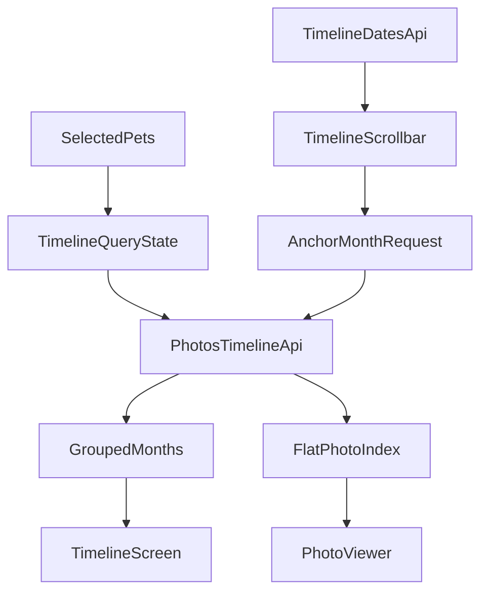

# Step 6: 照片时间轴

## 项目背景

「当当日记」是一个宠物日记 APP，使用 Flutter + FastAPI + PostgreSQL + MinIO 技术栈。本步骤实现照片时间轴功能，用户可以跨宠物按时间顺序浏览照片，并通过右侧月份滚动条快速跳转到任意月份。

**前置依赖**:
- Step 4 已完成: 照片上传、缩略图、原图 URL 接口可用
- Step 5 已验证无问题: 主导航中的「时间轴」Tab 已预留，健康模块不参与本步数据源

---

## 本步骤目标

1. 后端实现照片时间轴 API，支持多宠物筛选、游标分页、按月锚点跳转
2. 后端实现月份分布 API，供右侧时间轴滚动条展示和定位
3. Flutter 实现时间轴页面: 网格布局、按月分组、无限滚动、拖拽跳月
4. Flutter 实现大图查看器: 双指缩放、左右连续浏览、懒加载原图
5. 保证时间轴和查看器共用同一套筛选条件与游标语义，避免数据断层

---

## 1. 范围与关键决策

### 1.1 本步范围

- 时间轴只展示照片，不混入体重、驱虫、疫苗等健康记录
- 照片来源于当前用户通过 `pet_members` 可访问的所有宠物档案
- 顶部宠物筛选器为多选模式，空选择视为“全部可访问宠物”
- 时间轴主列表按月分组展示，但内部数据流必须保留一份全局有序的扁平照片索引，供大图查看器连续浏览

### 1.2 非目标

- 本步不实现“混合事件时间轴”
- 本步不改动 Step 4 的照片上传流程
- 本步不把健康记录回灌到时间轴中

### 1.3 统一排序规则

所有时间轴查询、月份锚点定位、查看器连续浏览都必须使用同一套稳定排序:

`taken_at desc, created_at desc, id desc`

说明:
- `taken_at` 是主时间字段，代表照片拍摄日期
- `created_at` 用于同一天多张照片时保持稳定顺序
- `id` 用于最终打破并列，保证游标可重复、可去重

游标必须基于这三个字段生成，推荐使用不透明字符串，不要把客户端绑定到具体编码格式。

---

## 2. 后端 API 规格

所有 API 需要 `Authorization: Bearer {access_token}` 头。

权限说明:
- 当前用户只能查询自己可访问宠物档案下的照片
- `pet_ids` 为空或缺省时，表示查询当前用户全部可访问宠物
- 若请求中的某个 `pet_id` 不在当前用户可访问范围内，应返回 `403`

### 2.1 获取时间轴照片

统一使用单接口 `GET /api/v1/photos/timeline`，通过 `cursor` 和 `anchor_month` 支持三类场景:

1. 首屏加载最新照片
2. 向更旧或更新方向继续补片
3. 拖动右侧时间轴后按月份锚点定位并插入一段新窗口

#### 请求示例

首屏加载:

```
GET /api/v1/photos/timeline?pet_ids=1,2&limit=40
Authorization: Bearer {access_token}
```

继续向更旧方向加载:

```
GET /api/v1/photos/timeline?pet_ids=1,2&cursor=eyJ0YWtlbl9hdCI6ICIyMDI0LTAxLTE1IiwgLi4ufQ==&direction=older&limit=40
Authorization: Bearer {access_token}
```

从已加载窗口向更新方向补片:

```
GET /api/v1/photos/timeline?pet_ids=1,2&cursor=eyJ0YWtlbl9hdCI6ICIyMDI0LTAxLTE1IiwgLi4ufQ==&direction=newer&limit=40
Authorization: Bearer {access_token}
```

按月份锚点定位:

```
GET /api/v1/photos/timeline?pet_ids=1,2&anchor_month=2024-01&limit=40
Authorization: Bearer {access_token}
```

#### 查询参数

- `pet_ids`: 宠物 ID 列表，逗号分隔，可选；为空或缺省表示全部可访问宠物
- `limit`: 单次返回的照片数量上限，默认 `40`，最大 `100`
- `cursor`: 不透明游标，可选；用于继续向 `older` 或 `newer` 方向加载
- `direction`: `older` 或 `newer`，默认 `older`；仅在传入 `cursor` 时有效
- `anchor_month`: 月份锚点，格式 `YYYY-MM`，可选；用于右侧时间轴拖拽定位

#### 参数约束

- `cursor` 和 `anchor_month` 互斥，不能同时传
- `direction` 只能与 `cursor` 一起使用
- `anchor_month` 格式错误、`cursor` 无法解析、`limit` 超出上限，都应返回 `400`
- 当筛选结果为空时，返回 `200` 和空数组，不返回 `404`

#### 成功响应 (200)

```json
{
  "groups": [
    {
      "date": "2024-01",
      "label": "2024年1月",
      "photos": [
        {
          "id": 101,
          "pet_id": 1,
          "pet_name": "橘子",
          "pet_type": "cat",
          "thumbnail_url": "/media/pet-photos/1/thumb-101.jpg",
          "taken_at": "2024-01-15",
          "created_at": "2024-01-20T10:30:00Z"
        },
        {
          "id": 99,
          "pet_id": 2,
          "pet_name": "年糕",
          "pet_type": "dog",
          "thumbnail_url": "/media/pet-photos/2/thumb-99.jpg",
          "taken_at": "2024-01-08",
          "created_at": "2024-01-09T08:15:00Z"
        }
      ]
    },
    {
      "date": "2023-12",
      "label": "2023年12月",
      "photos": [
        {
          "id": 88,
          "pet_id": 1,
          "pet_name": "橘子",
          "pet_type": "cat",
          "thumbnail_url": "/media/pet-photos/1/thumb-88.jpg",
          "taken_at": "2023-12-30",
          "created_at": "2024-01-01T11:00:00Z"
        }
      ]
    }
  ],
  "total": 150,
  "limit": 40,
  "prev_cursor": null,
  "next_cursor": "eyJ0YWtlbl9hdCI6ICIyMDIzLTEyLTMwIiwgLi4ufQ==",
  "has_more_newer": false,
  "has_more_older": true,
  "requested_anchor_month": null,
  "resolved_anchor_month": null,
  "date_range": {
    "earliest": "2023-01-15",
    "latest": "2024-01-20"
  }
}
```

#### 字段说明

- `groups`: 当前返回窗口按月分组后的结果；组内和组间顺序都必须符合统一排序规则
- `total`: 当前筛选条件下的照片总数，不受本次窗口大小影响
- `limit`: 本次查询使用的窗口大小
- `prev_cursor`: 指向当前窗口最前端，用于继续向 `newer` 方向补片；如果没有更“新”的内容则为 `null`
- `next_cursor`: 指向当前窗口最末端，用于继续向 `older` 方向补片；如果没有更“旧”的内容则为 `null`
- `has_more_newer`: 当前筛选条件下是否还存在比本窗口更“新”的照片
- `has_more_older`: 当前筛选条件下是否还存在比本窗口更“旧”的照片
- `requested_anchor_month`: 本次请求传入的锚点月份，首屏加载和普通滚动加载时为 `null`
- `resolved_anchor_month`: 后端实际命中的月份；如果请求月份在当前筛选条件下没有照片，可回退到最近的有照片月份
- `date_range`: 当前筛选条件下的全局最早和最新照片日期，供前端显示月份边界和空状态判断

#### 业务逻辑

- 查询源为 `photos` 表，按当前用户可访问的 `pet_id` 集合过滤
- 必须联表或补查宠物信息，返回 `pet_name` 和 `pet_type`
- 缩略图 URL 返回固定 `/media/...` 路径，不返回内网地址，不使用一次性签名 URL
- 首屏加载默认返回最新一段照片
- `direction=older` 时，返回排序上位于游标之后的更旧照片
- `direction=newer` 时，返回排序上位于游标之前的更新照片
- `anchor_month` 请求时，后端返回“覆盖目标月份的一段窗口”，前端据此把该窗口插入现有结果中，而不是清空整个时间轴

#### 月份锚点规则

- `anchor_month` 只接受 `YYYY-MM`
- 若目标月份已有照片，返回的窗口必须包含该月份照片，并优先让该月份出现在返回结果的前半段，便于前端滚动定位
- 若目标月份没有照片:
  - 优先回退到最近的更旧月份
  - 若不存在更旧月份，再回退到最近的更新月份
  - 若筛选条件下没有任何照片，返回空结果
- 前端右侧月份滚动条应优先使用 `GET /api/v1/photos/timeline/dates` 返回的月份列表，正常情况下不会拖到没有照片的月份；上述回退逻辑主要用于兜底和并发场景

#### 分组约束

- 一个返回窗口内仍按月份分组返回
- 同一个月份可能在多次请求中重复出现，前端必须按 `date` 合并，而不是简单拼接 `groups`
- 去重必须以 `photo.id` 为准，不能依赖月份或索引位置

### 2.2 获取时间轴日期分布

```
GET /api/v1/photos/timeline/dates?pet_ids=1,2
Authorization: Bearer {access_token}
```

#### 查询参数

- `pet_ids`: 宠物 ID 列表，逗号分隔，可选；为空或缺省表示全部可访问宠物

#### 成功响应 (200)

```json
{
  "months": [
    {
      "date": "2024-01",
      "label": "2024年1月",
      "count": 15
    },
    {
      "date": "2023-12",
      "label": "2023年12月",
      "count": 8
    },
    {
      "date": "2023-11",
      "label": "2023年11月",
      "count": 23
    }
  ],
  "date_range": {
    "earliest": "2023-01-15",
    "latest": "2024-01-20"
  }
}
```

#### 用途

- 右侧时间轴滚动条展示月份标记和相对密度
- 拖动时显示年月气泡提示
- 过滤条件变化后重新请求，用于刷新滚动条的月份范围和密度

### 2.3 获取照片原图

```
GET /api/v1/photos/{photo_id}/url
Authorization: Bearer {access_token}
```

成功响应 (200):

```json
{
  "url": "http://YOUR_SERVER_IP/media/pet-photos/1/xxx.jpg?X-Amz-...",
  "expires_in": 3600
}
```

说明:
- 该接口已在 Step 4 中实现，本步直接复用
- 大图查看器只在用户真正打开大图时才请求原图 URL
- 原图 URL 仍为临时签名地址，不缓存到长期状态中

---

## 3. Flutter 页面与数据流设计

### 3.1 页面整体布局

```
┌─────────────────────────────────┐
│  全部宠物 ▼  (多选宠物筛选器)     │
├─────────────────────────────────┤
│  ── 2024年1月 ──               │
│  ┌────┐ ┌────┐ ┌────┐ ┌────┐   │
│  │缩略图│ │缩略图│ │缩略图│ │缩略图│   │
│  └────┘ └────┘ └────┘ └────┘   │
│  ┌────┐ ┌────┐ ┌────┐          │
│  │缩略图│ │缩略图│ │缩略图│          │
│  └────┘ └────┘ └────┘          │
│                                 │
│  ── 2023年12月 ──               │
│  ...                            │
│                                 │
│  (继续向下滚动加载更旧照片...)      │
│                                 │
│                           ┌──┐  │
│                           │年│  │
│                           │月│  │
│                           │轴│  │
│                           └──┘  │
├─────────────────────────────────┤
│  记录  │  健康  │ 时间轴 │  AI  │ 我的 │
└─────────────────────────────────┘
```

### 3.2 核心交互

1. 顶部宠物筛选器
   - 使用现有 `PetSelector` 多选模式
   - 默认显示“全部宠物”
   - 当用户把已选宠物全部取消时，等价于“全部可访问宠物”
   - 筛选条件变化时，时间轴主数据和月份分布一起重载

2. 照片网格
   - 按月分组，每月一个标题
   - 每行 4 张缩略图，正方形裁切
   - 多宠物混合展示时，缩略图左下角显示宠物名字标签
   - 使用 `cached_network_image` 缓存缩略图
   - 滚动到底部时，按 `next_cursor` 继续加载更旧照片

3. 大图查看器
   - 点击缩略图进入全屏查看器
   - 使用 `photo_view` 支持双指缩放
   - 使用 `PageView` 支持左右连续浏览
   - 查看器使用时间轴同一份筛选条件和扁平照片索引，不以“当前月份”作为边界
   - 当滑到已加载数据边界附近时，自动用同一套游标继续补片

4. 右侧时间轴滚动条
   - 使用 `timeline/dates` 的月份分布绘制月份标记
   - 拖动时显示年月气泡
   - 如果目标月份已在本地加载，直接滚动到对应月份标题
   - 如果目标月份尚未加载，则发起 `anchor_month` 请求，把新窗口插入本地数据后再滚动到命中的月份

### 3.3 空状态

```
┌─────────────────────────────────┐
│                                 │
│                                 │
│          还没有照片哦             │
│      去「记录」页面上传第一张吧     │
│                                 │
│                                 │
└─────────────────────────────────┘
```

空状态触发条件:
- 当前筛选条件下没有任何照片
- `timeline/dates` 返回空 `months`
- 主列表首次加载成功，但 `groups` 为空

---

## 4. 前端数据模型与状态设计

### 4.1 基础模型

```dart
class TimelinePhoto {
  final int id;
  final int petId;
  final String petName;
  final String petType;
  final String thumbnailUrl;
  final DateTime takenAt;
  final DateTime createdAt;
}

class TimelineGroup {
  final String date; // "2024-01"
  final String label; // "2024年1月"
  final List<TimelinePhoto> photos;
}

class DateDistribution {
  final String date; // "2024-01"
  final String label;
  final int count;
}

class TimelineWindowResponse {
  final List<TimelineGroup> groups;
  final int total;
  final int limit;
  final String? prevCursor;
  final String? nextCursor;
  final bool hasMoreNewer;
  final bool hasMoreOlder;
  final String? requestedAnchorMonth;
  final String? resolvedAnchorMonth;

  List<TimelinePhoto> get flattenedPhotos =>
      groups.expand((group) => group.photos).toList();
}
```

### 4.2 Provider 内部状态

为了同时满足“按月分组展示”和“查看器连续浏览”，`TimelineProvider` 不应只存一份 `groups`，而应维护以下核心状态:

```dart
class TimelineState {
  final List<TimelineGroup> groups;
  final Map<int, TimelinePhoto> photoMap;
  final List<int> orderedPhotoIds; // 全局顺序: newest -> oldest
  final List<TimelineSegment> segments;
  final Map<String, int> monthFirstPhotoIndex;
  final List<DateDistribution> monthDistribution;
  final String? headCursor;
  final String? tailCursor;
  final bool hasMoreNewer;
  final bool hasMoreOlder;
  final bool isInitialLoading;
  final bool isLoadingMore;
  final Set<String> loadingAnchorMonths;
}

class TimelineSegment {
  final String segmentId;
  final String? prevCursor;
  final String? nextCursor;
  final List<int> photoIds;
}
```

说明:
- `groups` 给时间轴列表 UI 使用
- `orderedPhotoIds` 给大图查看器和边界预加载使用
- `segments` 记录每一段已加载窗口及其局部边界游标，方便拖拽跳月后做局部补片
- `monthFirstPhotoIndex` 用于把月份映射到滚动目标
- `headCursor` / `tailCursor` 表示整份已加载数据的全局两端游标

### 4.3 数据流总览



### 4.4 Provider 关键职责

- 首屏进入时间轴时:
  - 拉取 `timeline/dates`
  - 拉取最新窗口 `GET /photos/timeline`
  - 建立 `photoMap`、`orderedPhotoIds`、`groups`

- 底部无限滚动时:
  - 使用 `tailCursor` + `direction=older` 继续加载
  - 去重后追加到全局扁平索引
  - 重新生成受影响月份的 `groups`

- 拖动右侧月份条时:
  - 如果月份已加载，直接滚动
  - 如果未加载，调用 `anchor_month`
  - 收到响应后插入为新的 `segment`
  - 去重、重排、合并月份后再滚动到 `resolved_anchor_month`

- 大图查看器左右滑动时:
  - 从 `orderedPhotoIds` 获取当前页照片
  - 接近头尾边界时判断是否需要向 `newer` 或 `older` 方向补片
  - 使用对应游标请求后继续合并，不打断当前查看体验

### 4.5 合并策略

```dart
void mergeWindow(TimelineWindowResponse response) {
  for (final photo in response.flattenedPhotos) {
    photoMap[photo.id] = photo;
  }

  orderedPhotoIds = mergeAndSortByStableKey(
    orderedPhotoIds,
    response.flattenedPhotos.map((e) => e.id).toList(),
    photoMap,
  );

  segments = mergeSegments(segments, response);
  groups = regroupByMonth(orderedPhotoIds, photoMap);
  monthFirstPhotoIndex = rebuildMonthIndex(groups);
}
```

合并规则:
- 以 `photo.id` 去重
- 以统一排序规则重建全局顺序
- 如果新窗口与已有窗口发生重叠，合并 `segment`
- 同一个月跨多次请求出现时，只保留一个月份标题

---

## 5. Flutter 实现要点

### 5.1 时间轴主页面

- `timeline_screen.dart` 从占位页升级为真实页面
- 页面顶层建议使用 `Stack`
  - 底层为 `CustomScrollView`
  - 上层右侧叠加 `TimelineScrollbar`
- 使用 `SliverToBoxAdapter + SliverGrid` 渲染月份标题和照片网格
- 由于缩略图均为正方形，可固定网格比例，减少滚动过程中布局抖动

### 5.2 右侧时间轴滚动条

滚动条实现建议:

- 输入:
  - `monthDistribution`
  - 当前屏幕滚动位置
  - 当前已加载月份索引
- 输出:
  - 拖动过程中的气泡文案
  - 目标月份 `YYYY-MM`
  - 对应的跳转动作

处理流程:

1. 拖动时根据手指位置映射到最近的月份标记
2. 显示 `label` 气泡，例如“2024年1月”
3. 拖动结束后:
   - 若该月份已加载，直接滚动到月份标题
   - 若未加载，调用 `jumpToMonth(month)`
4. `jumpToMonth` 请求成功后滚动到 `resolved_anchor_month`

### 5.3 大图查看器

查看器必须是“当前筛选条件下的连续照片浏览”，不是“当前月份内浏览”。

建议实现:

```dart
class PhotoViewerScreen extends ConsumerStatefulWidget {
  final int initialPhotoId;

  // 通过 provider 读取 orderedPhotoIds，而不是只传当前分组 photos
}
```

核心逻辑:

- 打开查看器时，根据 `initialPhotoId` 找到在 `orderedPhotoIds` 中的索引
- `PageView.builder` 以 `orderedPhotoIds.length` 为当前长度
- 每一页按需调用 `getOriginalUrl(photoId)`，拿到签名 URL 后交给 `PhotoView`
- 当当前索引距离头部或尾部不足 3 张时，触发预加载:
  - 靠近头部且 `hasMoreNewer == true` 时，请求 `direction=newer`
  - 靠近尾部且 `hasMoreOlder == true` 时，请求 `direction=older`

### 5.4 宠物筛选切换

筛选切换时不能在旧状态上硬拼:

- 清空当前 `segments`、`photoMap`、`orderedPhotoIds`
- 重新请求 `timeline/dates`
- 重新请求最新窗口
- 重置滚动位置到顶部
- 查看器打开时若筛选发生变化，应关闭查看器或重新绑定到新的时间轴状态，避免游标语义错乱

---

## 6. 性能与实现约束

1. 缩略图统一走 `/media/...` 固定路径，配合 `cached_network_image` 做缓存
2. 原图只在查看器中懒加载，避免主时间轴页面请求大图
3. 主列表使用 `Sliver` 体系，避免一次性构建大量网格子项
4. 月份标题和网格高度尽量稳定，便于右侧月份跳转后的滚动定位
5. `timeline/dates` 应只返回有照片的月份，减少滚动条无效标记
6. 同一筛选条件下，时间轴列表和查看器必须共享同一套 provider 状态，避免重复拉取和顺序错位
7. 单次窗口大小默认 40，必要时允许查看器向两端补片，但每次仍受 `limit <= 100` 约束

---

## 7. 需要创建/修改的文件清单

### 后端

- `backend/app/api/v1/photos.py`
  - 将占位 `GET /photos/timeline` 改为正式时间轴接口
  - 新增 `GET /photos/timeline/dates`
  - 接入当前用户权限校验与多 `pet_id` 过滤

- `backend/app/schemas/photo.py`
  - 新增时间轴照片 DTO、月份分组 DTO、游标响应 DTO、日期分布 DTO

- `backend/tests/test_timeline.py`
  - 新增时间轴接口测试

### 前端

- `frontend/lib/models/timeline.dart`
  - 新建时间轴模型、日期分布模型、游标响应模型

- `frontend/lib/services/photo_service.dart`
  - 新增 `getTimeline(...)`
  - 新增 `getTimelineDates(...)`

- `frontend/lib/providers/timeline_provider.dart`
  - 新建时间轴状态管理
  - 维护 `groups`、`orderedPhotoIds`、`segments`、游标状态

- `frontend/lib/screens/timeline/timeline_screen.dart`
  - 从占位页升级为真实时间轴页面

- `frontend/lib/screens/timeline/photo_viewer_screen.dart`
  - 新建全屏大图查看器

- `frontend/lib/widgets/timeline_scrollbar.dart`
  - 新建右侧月份拖拽滚动条

- `frontend/lib/widgets/photo_grid_tile.dart`
  - 新建缩略图格子组件

- `frontend/test/providers/timeline_provider_test.dart`
  - 新增 provider 合并逻辑测试

### 已存在依赖

`frontend/pubspec.yaml` 中已包含:
- `cached_network_image`
- `photo_view`

本步直接复用，不需要重复引入。

---

## 8. 测试建议

### 8.1 后端测试

至少覆盖以下场景:

1. 首屏加载:
   - 返回最新照片窗口
   - 响应中包含 `groups`、`prev_cursor`、`next_cursor`、`date_range`

2. 多宠物筛选:
   - 只返回指定 `pet_ids` 的照片
   - `pet_ids` 为空时返回全部可访问宠物照片

3. 权限校验:
   - 请求包含无权限 `pet_id` 时返回 `403`

4. 游标稳定性:
   - `direction=older` 不重复返回已加载照片
   - `direction=newer` 不重复返回已加载照片
   - 同 `taken_at` 下能依赖 `created_at` 和 `id` 稳定排序

5. 锚点跳月:
   - `anchor_month` 命中有照片月份
   - `anchor_month` 命中空月份时正确回退到 `resolved_anchor_month`

6. 日期分布:
   - `timeline/dates` 只返回有照片的月份
   - `count` 与实际月份照片数一致

### 8.2 前端测试

建议至少覆盖:

1. `TimelineProvider` 合并逻辑
   - 同月跨批次合并
   - 相同 `photo.id` 去重
   - 锚点窗口插入后全局顺序仍正确

2. 筛选逻辑
   - 空选择视为全部
   - 切换筛选后状态完全重置

3. 查看器逻辑
   - 从任意缩略图打开时能定位到正确索引
   - 接近边界时触发补片

4. 右侧月份条
   - 已加载月份直接跳转
   - 未加载月份触发 `anchor_month` 请求并滚动到命中的月份

---

## 9. 验收标准

- [ ] 后端 `GET /api/v1/photos/timeline` 已替换占位实现，支持 `pet_ids`、`cursor`、`direction`、`anchor_month`
- [ ] 后端时间轴接口返回按月分组的数据，并带有 `prev_cursor` / `next_cursor`
- [ ] 后端时间轴接口按 `taken_at desc, created_at desc, id desc` 稳定排序
- [ ] 后端 `GET /api/v1/photos/timeline/dates` 正确返回月份分布
- [ ] 后端时间轴接口在多宠物筛选和权限校验下行为正确
- [ ] Flutter 时间轴页面展示照片网格，每行 4 张
- [ ] Flutter 时间轴页面按月分组，显示月份标题
- [ ] Flutter 多宠物混合展示时显示宠物名字标签
- [ ] Flutter 滚动到底部时按游标加载更旧照片
- [ ] Flutter 顶部多选宠物筛选器工作正常，空选择等于全部宠物
- [ ] Flutter 右侧时间轴滚动条可拖动，并显示年月气泡
- [ ] Flutter 拖到未加载月份时，会请求 `anchor_month` 并把返回窗口插入现有时间轴，而不是清空重来
- [ ] Flutter 点击缩略图可进入大图查看器
- [ ] Flutter 大图支持双指缩放
- [ ] Flutter 大图支持左右连续浏览当前筛选条件下的全量照片
- [ ] Flutter 查看器在接近边界时可自动补片，不出现明显断层
- [ ] 当前筛选条件下没有照片时，页面显示空状态提示
- [ ] 缩略图滚动流畅，无明显卡顿或重复闪烁

---

## 10. 实现风险与注意事项

1. 同月跨窗口合并
   - 由于 `anchor_month` 和底部滚动都可能返回同一个月份，前端必须按 `photo.id` 去重并按月份重新分组

2. 游标排序不稳定
   - 如果后端只按 `taken_at` 生成游标，同一天照片会出现重复、漏数或顺序跳变
   - 必须把 `taken_at + created_at + id` 作为完整排序键

3. 锚点窗口与已有窗口重叠
   - 跳月后插入的数据很可能和旧窗口重叠，前端合并时需要识别重叠并合并 `segment`

4. 滚动定位偏移不准
   - 如果月份标题高度或网格高度不稳定，拖拽月份条后的滚动位置会抖动
   - 建议使用固定网格比例，并在图片未加载完成时保留占位尺寸

5. 查看器与列表状态脱节
   - 查看器不能只拿“点击时所在月份”的照片数组，否则无法满足连续浏览
   - 必须读取全局 `orderedPhotoIds`

6. 筛选切换并发
   - 切换宠物筛选后，要丢弃旧请求结果，避免旧窗口回写到新状态
